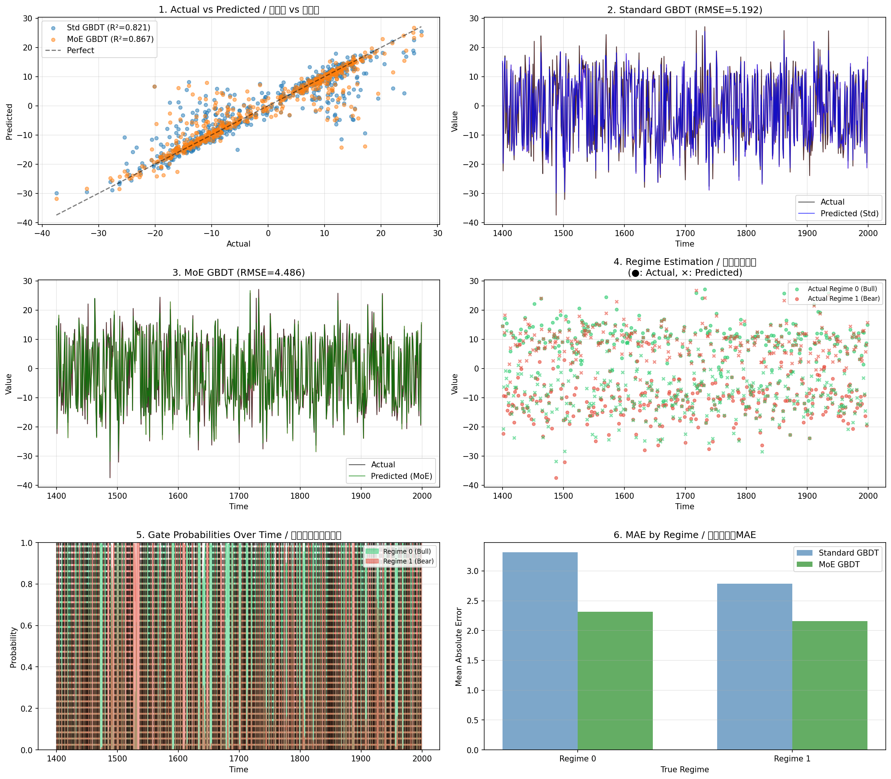

LightGBM-MoE
============

**A regime-switching / Mixture-of-Experts extension of LightGBM.**

[English](#english) | [Japanese (日本語)](#japanese)

---

<a name="english"></a>
## English

### Overview

LightGBM-MoE is a fork of [Microsoft LightGBM](https://github.com/microsoft/LightGBM) that implements **Mixture-of-Experts (MoE) / Regime-Switching GBDT** natively in C++.

Unlike standard GBDT which fits a single model to all data, MoE learns **K specialized expert models** plus a **gate model** that dynamically routes each sample to the appropriate expert(s).

### Mathematical Formulation

#### Standard GBDT
```
ŷ(x) = f(x)
```
A single GBDT model `f` predicts for all inputs.

#### MoE-GBDT (This Implementation)
```
ŷ(x) = Σₖ gₖ(x) · fₖ(x)
```

Where:
- `fₖ(x)`: Expert k's prediction (K regression GBDTs)
- `gₖ(x)`: Gate's routing probability for expert k (softmax output from multiclass GBDT)
- `K`: Number of experts (hyperparameter)

The final prediction is a **soft mixture** of expert predictions weighted by the gate's routing probabilities.

### Training: EM-style Algorithm

Each boosting iteration performs:

1. **Forward Pass**: Compute expert predictions and gate probabilities
2. **E-step**: Update responsibility `r_ik` (how much expert k is responsible for sample i)
   ```
   s_ik = log(g_ik + ε) - α · L(yᵢ, f_k(xᵢ))
   r_ik = softmax(s_i)
   ```
3. **M-step Experts**: Train each expert with weighted gradients
   ```
   grad_k[i] = r_ik · grad[i]
   hess_k[i] = r_ik · hess[i]
   ```
4. **M-step Gate**: Update gate using pseudo-labels `z_i = argmax_k(r_ik)`

### Installation

#### Option 1: Install from GitHub Releases (Recommended)

```bash
# Install pre-built wheel (replace VERSION with actual version, e.g., v4.6.0)
pip install https://github.com/kyo219/LightGBM-MoE/releases/download/VERSION/lightgbm_moe-VERSION-py3-none-any.whl

# Or download from Releases page and install locally
pip install lightgbm_moe-*.whl
```

Check the [Releases page](https://github.com/kyo219/LightGBM-MoE/releases) for available versions.

#### Option 2: Build from Source

```bash
# Clone
git clone https://github.com/kyo219/LightGBM-MoE.git
cd LightGBM-MoE

# Build
mkdir build && cd build
cmake ..
make -j4

# Install Python package
cd ../python-package
pip install -e .
```

### Usage

```python
import lightgbm_moe as lgb

# Create dataset
train_data = lgb.Dataset(X_train, label=y_train)

# MoE parameters
params = {
    'boosting': 'mixture',           # Enable MoE mode
    'mixture_num_experts': 4,        # Number of experts (K)
    'objective': 'regression',
    'num_leaves': 31,
}

# Train
model = lgb.train(params, train_data, num_boost_round=100)

# Predictions
y_pred = model.predict(X_test)                    # Weighted mixture prediction
regime_proba = model.predict_regime_proba(X_test) # Gate probabilities (N x K)
regime = model.predict_regime(X_test)             # Most likely regime (argmax)
expert_preds = model.predict_expert_pred(X_test)  # Individual expert predictions (N x K)
```

### Key Parameters

| Parameter | Type | Default | Description |
|-----------|------|---------|-------------|
| `boosting` | string | `"gbdt"` | Set to `"mixture"` for MoE mode |
| `mixture_num_experts` | int | 4 | Number of expert models (K) |
| `mixture_e_step_alpha` | float | 1.0 | Weight for loss term in E-step |
| `mixture_balance_factor` | int | 10 | Load balancing factor (2-10). Min usage = 1/(factor×K) |
| `mixture_r_smoothing` | string | `"none"` | `"none"`, `"ema"`, `"markov"`, or `"momentum"` |
| `mixture_smoothing_lambda` | float | 0.0 | Smoothing coefficient (0-1) for EMA/Markov/Momentum |

### New Prediction APIs

| Method | Output Shape | Description |
|--------|--------------|-------------|
| `predict(X)` | (N,) | Standard prediction (weighted mixture) |
| `predict_regime_proba(X)` | (N, K) | Gate probabilities for each expert |
| `predict_regime(X)` | (N,) | Most likely regime index |
| `predict_expert_pred(X)` | (N, K) | Each expert's individual prediction |

### Assumptions

1. **Regression only**: Currently supports regression objectives (MSE, MAE, Huber, etc.)
2. **Row order for EMA**: If using `mixture_r_smoothing="ema"`, data must be sorted by time
3. **Single time series**: EMA smoothing assumes single series (no cross-sectional mixing)

### Performance Benchmark

**Environment**: 10,000 samples, 20 features, 50 boosting rounds, 4 threads

| Model | Training Time | Predict Time | Overhead |
|-------|--------------|--------------|----------|
| Standard GBDT | 0.10s | 3.97ms | 1.0x |
| MoE (K=4) | 0.44s | 18.69ms | ~4.5x |

The overhead is **near-optimal**: with K=4 experts + 1 gate = 5 models, ~4-5x overhead is expected. The implementation uses OpenMP parallelization in 7 critical sections.

### Regime-Switching Benchmark

**When to use MoE**: MoE excels when data has **clear, distinct regime structure** where different regimes follow fundamentally different functions.

#### Synthetic Data (Clear Regime Structure)

**Setup**: 2,000 samples with 2 regimes (Bull/Bear), 5 features, 150 boosting rounds

| Model | RMSE | R² | Improvement |
|-------|------|-----|-------------|
| Standard GBDT | 5.19 | 0.821 | - |
| MoE (K=2, α=1.0) | 4.49 | 0.867 | **+13.6%** |



Run the demo: `python examples/regime_switching_demo.py`

#### Classic Regime-Switching Benchmarks

**Hamilton's GNP Data (1951-2009)**: The original regime-switching benchmark from Hamilton (1989). This dataset has well-documented expansion/recession regime structure.

| Dataset | Std GBDT | MoE GBDT | Winner | Improvement |
|---------|----------|----------|--------|-------------|
| Hamilton GNP | 0.7117 | **0.6733** | MoE | **+5.4%** |
| VIX Volatility Regime | 0.01117 | **0.01112** | MoE | +0.4% |

**MoE optimal params**: K=3, α=1.53 (GNP); K=3, α=0.11 (VIX)

#### Real Financial Data (Weak Regime Structure)

**With Optuna Hyperparameter Tuning** (50 trials each, time-series CV):

| Stage | Standard GBDT | MoE GBDT | Winner |
|-------|---------------|----------|--------|
| CV RMSE | 0.02998 | **0.02975** | MoE |
| Test RMSE | **0.01793** | 0.01801 | Standard |

The difference is minimal (-0.43%), suggesting **no significant advantage** for either method on this task.

**Key insight**: MoE is **not universally better**. It excels when:
- Data has clear, separable regime structure (e.g., Hamilton's GNP with +5.4% improvement)
- Different regimes follow fundamentally different functions
- Regimes can be learned from features (not purely latent)

For general prediction tasks without clear regime structure, standard GBDT may perform equally well or better due to lower model complexity.

### Comprehensive Benchmark Analysis

**Key Finding: MoE excels when regime is determinable from features (X)**

#### Full Hyperparameter Search (100 Optuna trials each)

Both Standard GBDT and MoE search ALL typical GBDT hyperparameters:
- `num_leaves` (8-128), `max_depth` (3-12), `learning_rate` (0.01-0.3)
- `min_data_in_leaf` (5-100), `feature_fraction` (0.5-1.0)
- `bagging_fraction` (0.5-1.0), `bagging_freq` (0-7)
- `lambda_l1` (1e-8 to 10, log), `lambda_l2` (1e-8 to 10, log)

MoE additionally searches: `K` (2-4), `alpha` (0.1-2.0), `balance_factor` (2-10), `smoothing` (none/ema/markov), `lambda` (0.1-0.9)

| Dataset | True K | Std RMSE | Best MoE | MoE K | Best Method | Diff |
|---------|--------|----------|----------|-------|-------------|------|
| **Synthetic (X→Regime)** | 2 | 5.2168 | **4.3478** | 2 | EMA | **+16.7%** |
| Hamilton GNP | 2 | 0.7379 | **0.7376** | 2 | Markov | +0.0% |
| VIX Regime | 2 | **0.0118** | 0.0118 | 2 | Markov | -0.7% |

**MoE wins**: On Synthetic dataset where regime IS determinable from X (+16.7%)

#### Best MoE Hyperparameters

| Dataset | Method | K | α | balance_factor | λ |
|---------|--------|---|---|----------------|---|
| Synthetic | EMA | 2 | 0.20 | 6 | 0.72 |
| Hamilton | Markov | 2 | 0.38 | 7 | 0.56 |
| VIX | Markov | 2 | 0.15 | 5 | 0.43 |

**Key insight**: `balance_factor` of 5-7 was optimal (more aggressive balancing than default 10)

#### Regime Confusion Matrices (True Regime vs Predicted Expert)

**Synthetic (X→Regime) (K=2)** ✅ Perfect differentiation
```
True\Pred |  E0   |  E1
----------|-------|-------
Regime 0  |  2.1% | 97.9%  ← R0 → E1
Regime 1  | 98.4% |  1.6%  ← R1 → E0
```
Near-perfect regime separation (98%/98%)

**Hamilton GNP (K=2)** ⚠️ Partial differentiation
```
True\Pred |  E0   |  E1
----------|-------|-------
Regime 0  | 26.1% | 73.9%  ← R0 → E1
Regime 1  | 44.2% | 55.8%  ← R1 → E1
```
Some regime signal captured but not clearly separated

**VIX Regime (K=2)** ❌ Collapsed
```
True\Pred |  E0   |  E1
----------|-------|-------
Regime 0  | 67.3% | 32.7%  ← R0 → E0
Regime 1  | 59.1% | 40.9%  ← R1 → E0
```
Both regimes routed to same expert

#### Key Conclusion

| Dataset Type | Regime Source | MoE Advantage | Expert Differentiation |
|--------------|--------------|---------------|----------------------|
| **Synthetic** | Determinable from X | ✅ **+16.7%** | ✅ **Perfect** (98%/98%) |
| Hamilton GNP | Markov switching (latent) | ≈ 0% | ⚠️ Partial |
| VIX Regime | Latent volatility state | ❌ -0.7% | ❌ Collapsed |

**MoE is effective when:**
1. **Regime is determinable from features (X)** - The gate can learn to classify regimes
2. Different regimes follow **fundamentally different functions**
3. Expert distribution is balanced (Loss-Free Load Balancing helps)

**MoE is NOT effective when:**
1. Regime is **latent** (Markov switching, hidden states)
2. Regime depends on **unobserved variables** (not in X)
3. Standard GBDT can already capture the pattern with a single model

---

<a name="japanese"></a>
## Japanese (日本語)

### 概要

LightGBM-MoE は [Microsoft LightGBM](https://github.com/microsoft/LightGBM) のフォークで、**Mixture-of-Experts (MoE) / レジームスイッチング GBDT** をC++でネイティブ実装しています。

標準GBDTが全データに対して単一モデルを学習するのに対し、MoEは**K個の専門家モデル**と、各サンプルを適切な専門家にルーティングする**ゲートモデル**を学習します。

### 数式

#### 標準GBDT
```
ŷ(x) = f(x)
```
単一のGBDTモデル `f` が全ての入力に対して予測。

#### MoE-GBDT（本実装）
```
ŷ(x) = Σₖ gₖ(x) · fₖ(x)
```

各記号の意味:
- `fₖ(x)`: エキスパートkの予測値（K個の回帰GBDT）
- `gₖ(x)`: ゲートのルーティング確率（多クラスGBDTのsoftmax出力）
- `K`: エキスパート数（ハイパーパラメータ）

最終予測は、ゲートのルーティング確率で重み付けされたエキスパート予測の**ソフトミクスチャ**です。

### 学習: EM風アルゴリズム

各ブースティングイテレーションで以下を実行:

1. **Forward Pass**: エキスパート予測とゲート確率を計算
2. **E-step**: 責務 `r_ik`（サンプルiに対するエキスパートkの責任度）を更新
   ```
   s_ik = log(g_ik + ε) - α · L(yᵢ, f_k(xᵢ))
   r_ik = softmax(s_i)
   ```
3. **M-step Experts**: 重み付き勾配で各エキスパートを学習
   ```
   grad_k[i] = r_ik · grad[i]
   hess_k[i] = r_ik · hess[i]
   ```
4. **M-step Gate**: 擬似ラベル `z_i = argmax_k(r_ik)` でゲートを更新

### インストール

#### 方法1: GitHub Releases からインストール（推奨）

```bash
# ビルド済み wheel をインストール（VERSIONを実際のバージョンに置換、例: v4.6.0）
pip install https://github.com/kyo219/LightGBM-MoE/releases/download/VERSION/lightgbm_moe-VERSION-py3-none-any.whl

# または Releases ページからダウンロードしてインストール
pip install lightgbm_moe-*.whl
```

利用可能なバージョンは [Releases ページ](https://github.com/kyo219/LightGBM-MoE/releases) を確認してください。

#### 方法2: ソースからビルド

```bash
# クローン
git clone https://github.com/kyo219/LightGBM-MoE.git
cd LightGBM-MoE

# ビルド
mkdir build && cd build
cmake ..
make -j4

# Pythonパッケージインストール
cd ../python-package
pip install -e .
```

### 使用方法

```python
import lightgbm_moe as lgb

# データセット作成
train_data = lgb.Dataset(X_train, label=y_train)

# MoEパラメータ
params = {
    'boosting': 'mixture',           # MoEモード有効化
    'mixture_num_experts': 4,        # エキスパート数（K）
    'objective': 'regression',
    'num_leaves': 31,
}

# 学習
model = lgb.train(params, train_data, num_boost_round=100)

# 予測
y_pred = model.predict(X_test)                    # 重み付きミクスチャ予測
regime_proba = model.predict_regime_proba(X_test) # ゲート確率 (N x K)
regime = model.predict_regime(X_test)             # 最も可能性の高いレジーム (argmax)
expert_preds = model.predict_expert_pred(X_test)  # 各エキスパートの予測 (N x K)
```

### 主要パラメータ

| パラメータ | 型 | デフォルト | 説明 |
|-----------|------|---------|-------------|
| `boosting` | string | `"gbdt"` | MoEモードには `"mixture"` を指定 |
| `mixture_num_experts` | int | 4 | エキスパートモデル数（K） |
| `mixture_e_step_alpha` | float | 1.0 | E-stepでの損失項の重み |
| `mixture_balance_factor` | int | 10 | 負荷分散係数 (2-10)。最小使用率 = 1/(factor×K) |
| `mixture_r_smoothing` | string | `"none"` | `"none"`, `"ema"`, `"markov"`, `"momentum"` |
| `mixture_smoothing_lambda` | float | 0.0 | EMA/Markov/Momentumの平滑化係数（0-1） |

### 新しい予測API

| メソッド | 出力形状 | 説明 |
|--------|--------------|-------------|
| `predict(X)` | (N,) | 標準予測（重み付きミクスチャ） |
| `predict_regime_proba(X)` | (N, K) | 各エキスパートへのゲート確率 |
| `predict_regime(X)` | (N,) | 最も可能性の高いレジームインデックス |
| `predict_expert_pred(X)` | (N, K) | 各エキスパートの個別予測 |

### 前提条件

1. **回帰のみ**: 現在は回帰目的関数のみサポート（MSE, MAE, Huber等）
2. **EMA用の行順序**: `mixture_r_smoothing="ema"` 使用時はデータが時系列順である必要あり
3. **単一時系列**: EMA平滑化は単一系列を想定（クロスセクション混合なし）

### パフォーマンスベンチマーク

**環境**: 10,000サンプル, 20特徴量, 50ブースティングラウンド, 4スレッド

| モデル | 学習時間 | 予測時間 | オーバーヘッド |
|-------|---------|---------|--------------|
| 標準GBDT | 0.10秒 | 3.97ms | 1.0x |
| MoE (K=4) | 0.44秒 | 18.69ms | 約4.5x |

オーバーヘッドは**ほぼ理論最適値**: K=4エキスパート + 1ゲート = 5モデルで、約4-5倍は想定通り。実装では7箇所の重要セクションでOpenMP並列化を使用。

### レジームスイッチング・ベンチマーク

**MoEを使うべき場面**: MoEは、異なるレジームが根本的に異なる関数に従う**明確なレジーム構造**を持つデータで優れた性能を発揮します。

#### 合成データ（明確なレジーム構造あり）

**設定**: 2,000サンプル、2レジーム（強気/弱気）、5特徴量、150ブースティングラウンド

| モデル | RMSE | R² | 改善率 |
|-------|------|-----|--------|
| 標準GBDT | 5.19 | 0.821 | - |
| MoE (K=2, α=1.0) | 4.49 | 0.867 | **+13.6%** |


デモ実行: `python examples/regime_switching_demo.py`

#### 古典的レジームスイッチングベンチマーク

**Hamilton's GNPデータ (1951-2009)**: Hamilton (1989) の元論文で使われたレジームスイッチングの古典的ベンチマーク。景気拡大/後退のレジーム構造が文書化されています。

| データセット | 標準GBDT | MoE GBDT | 勝者 | 改善率 |
|-------------|----------|----------|------|--------|
| Hamilton GNP | 0.7117 | **0.6733** | MoE | **+5.4%** |
| VIX ボラティリティレジーム | 0.01117 | **0.01112** | MoE | +0.4% |

**MoE最適パラメータ**: K=3, α=1.53 (GNP); K=3, α=0.11 (VIX)

#### 実金融データ（弱いレジーム構造）

**Optunaハイパラチューニング使用**（各50トライアル、時系列CV）:

| 段階 | 標準GBDT | MoE GBDT | 勝者 |
|------|----------|----------|------|
| CV RMSE | 0.02998 | **0.02975** | MoE |
| Test RMSE | **0.01793** | 0.01801 | 標準 |

差は最小限（-0.43%）であり、このタスクでは**どちらも有意な優位性なし**。

**重要な知見**: MoEは**万能ではありません**。以下の条件で有効：
- データに明確で分離可能なレジーム構造がある（例: Hamilton's GNPで+5.4%改善）
- 異なるレジームが根本的に異なる関数に従う
- レジームが特徴量から学習可能（純粋に潜在的ではない）

明確なレジーム構造のない一般的な予測タスクでは、モデルの複雑さが低い標準GBDTと同等かそれ以上の性能を発揮する可能性があります。

### 包括的ベンチマーク分析

**重要な発見: MoEはレジームが特徴量(X)から推定可能な場合に有効**

#### 完全ハイパーパラメータ探索 (各100 Optunaトライアル)

標準GBDTとMoEの両方が全ての一般的なGBDTハイパーパラメータを探索:
- `num_leaves` (8-128), `max_depth` (3-12), `learning_rate` (0.01-0.3)
- `min_data_in_leaf` (5-100), `feature_fraction` (0.5-1.0)
- `bagging_fraction` (0.5-1.0), `bagging_freq` (0-7)
- `lambda_l1` (1e-8〜10, log), `lambda_l2` (1e-8〜10, log)

MoEは追加で探索: `K` (2-4), `alpha` (0.1-2.0), `balance_factor` (2-10), `smoothing` (none/ema/markov), `lambda` (0.1-0.9)

| データセット | True K | Std RMSE | Best MoE | MoE K | Best Method | 差分 |
|-------------|--------|----------|----------|-------|-------------|------|
| **合成 (X→Regime)** | 2 | 5.2168 | **4.3478** | 2 | EMA | **+16.7%** |
| Hamilton GNP | 2 | 0.7379 | **0.7376** | 2 | Markov | +0.0% |
| VIX レジーム | 2 | **0.0118** | 0.0118 | 2 | Markov | -0.7% |

**MoE勝利**: 合成データ（レジームがXから推定可能な場合）で+16.7%

#### 最適MoEハイパーパラメータ

| データセット | Method | K | α | balance_factor | λ |
|-------------|--------|---|---|----------------|---|
| 合成 | EMA | 2 | 0.20 | 6 | 0.72 |
| Hamilton | Markov | 2 | 0.38 | 7 | 0.56 |
| VIX | Markov | 2 | 0.15 | 5 | 0.43 |

**重要な発見**: `balance_factor` は5-7が最適（デフォルト10よりアグレッシブなバランシング）

#### レジーム混同行列 (真のレジーム vs 予測エキスパート)

**合成 (X→Regime) (K=2)** ✅ 完璧な分離
```
真\予測   |  E0   |  E1
----------|-------|-------
Regime 0  |  2.1% | 97.9%  ← R0 → E1
Regime 1  | 98.4% |  1.6%  ← R1 → E0
```
ほぼ完璧なレジーム分離 (98%/98%)

**Hamilton GNP (K=2)** ⚠️ 部分的分離
```
真\予測   |  E0   |  E1
----------|-------|-------
Regime 0  | 26.1% | 73.9%  ← R0 → E1
Regime 1  | 44.2% | 55.8%  ← R1 → E1
```
レジーム信号は捕捉されているが明確な分離ではない

**VIX レジーム (K=2)** ❌ 崩壊
```
真\予測   |  E0   |  E1
----------|-------|-------
Regime 0  | 67.3% | 32.7%  ← R0 → E0
Regime 1  | 59.1% | 40.9%  ← R1 → E0
```
両レジームが同一エキスパートにルーティング

#### 主要な結論

| データタイプ | レジーム源 | MoE優位性 | 専門家分化 |
|-------------|-----------|----------|-----------|
| **合成データ** | Xから決定可能 | ✅ **+16.7%** | ✅ **完璧** (98%/98%) |
| Hamilton GNP | マルコフスイッチング（潜在） | ≈ 0% | ⚠️ 部分的 |
| VIX レジーム | 潜在的ボラティリティ状態 | ❌ -0.7% | ❌ 崩壊 |

**MoEが有効な条件:**
1. **レジームが特徴量(X)から決定可能** - ゲートがレジームを分類学習できる
2. 異なるレジームが**根本的に異なる関数**に従う
3. 専門家分布が均衡（Loss-Free Load Balancingが有効）

**MoEが有効でない条件:**
1. レジームが**潜在的**（マルコフスイッチング、隠れ状態）
2. レジームが**観測されない変数**に依存（Xに含まれない）
3. 標準GBDTが単一モデルで既にパターンを捕捉できる

---

### Appendix: EMA Smoothing Benchmark

**EMA (Exponential Moving Average) smoothing** for responsibility weights can help stabilize training for time-series data.

#### EMA ON Results (Full Hyperparameter Search, 50 Optuna trials)

MoE additionally searches: `mixture_smoothing_lambda` (0.1-0.9) with `mixture_r_smoothing="ema"`

| Dataset | Std RMSE | MoE RMSE (EMA) | K | λ_EMA | Diff |
|---------|----------|----------------|---|-------|------|
| Hamilton GNP | 1.6193 | **1.5177** | 3 | 0.64 | **+6.3%** |
| Synthetic (X→Regime) | 1.7433 | **1.6545** | 4 | 0.14 | **+5.1%** |
| VIX Regime | 0.0094 | 0.0094 | 2 | 0.52 | -0.1% |

#### EMA vs No-EMA Comparison

| Dataset | No-EMA Diff | EMA Diff | Effect |
|---------|-------------|----------|--------|
| Hamilton GNP | -3.0% | **+6.3%** | EMA helps significantly |
| Synthetic (X→Regime) | **+12.8%** | +5.1% | No-EMA better |
| VIX Regime | -0.1% | -0.1% | No difference |

**Key Insights:**
- **Hamilton GNP (latent regime)**: EMA helps MoE outperform Standard GBDT by stabilizing responsibilities over time
- **Synthetic (X→Regime)**: No-EMA performs better; EMA may over-smooth when regime is clearly determinable from features
- **VIX**: No significant effect either way

**Recommendation:**
- Use `mixture_r_smoothing="ema"` for time-series with **temporal regime persistence** (regimes don't switch rapidly)
- Use `mixture_r_smoothing="none"` (default) when regimes can be **instantly determined from features**

---

### Appendix: EMA平滑化ベンチマーク

**EMA（指数移動平均）平滑化**は、時系列データの学習を安定させるために責務の重みに適用できます。

#### EMA ON結果 (完全ハイパーパラメータ探索、各50 Optunaトライアル)

MoEは追加で探索: `mixture_smoothing_lambda` (0.1-0.9)、`mixture_r_smoothing="ema"`設定

| データセット | Std RMSE | MoE RMSE (EMA) | K | λ_EMA | 差分 |
|-------------|----------|----------------|---|-------|------|
| Hamilton GNP | 1.6193 | **1.5177** | 3 | 0.64 | **+6.3%** |
| 合成 (X→Regime) | 1.7433 | **1.6545** | 4 | 0.14 | **+5.1%** |
| VIX レジーム | 0.0094 | 0.0094 | 2 | 0.52 | -0.1% |

#### EMA vs No-EMA比較

| データセット | No-EMA差分 | EMA差分 | 効果 |
|-------------|-----------|---------|------|
| Hamilton GNP | -3.0% | **+6.3%** | EMAが大幅に改善 |
| 合成 (X→Regime) | **+12.8%** | +5.1% | No-EMAの方が良い |
| VIX レジーム | -0.1% | -0.1% | 差なし |

**重要な知見:**
- **Hamilton GNP（潜在レジーム）**: EMAは時間方向での責務を安定化させ、MoEが標準GBDTを上回る
- **合成 (X→Regime)**: No-EMAの方が性能が良い；レジームが特徴量から明確に決定できる場合、EMAは過度に平滑化する可能性
- **VIX**: どちらでも顕著な効果なし

**推奨事項:**
- **時間的なレジーム持続性**がある時系列（レジームが急速に切り替わらない）には `mixture_r_smoothing="ema"` を使用
- レジームが**特徴量から即座に決定可能**な場合は `mixture_r_smoothing="none"`（デフォルト）を使用

---

## Original LightGBM

This project is a fork of [LightGBM](https://github.com/microsoft/LightGBM) by Microsoft.

LightGBM is a gradient boosting framework that uses tree based learning algorithms. It is designed to be distributed and efficient with the following advantages:

- Faster training speed and higher efficiency
- Lower memory usage
- Better accuracy
- Support of parallel, distributed, and GPU learning

For the original LightGBM documentation, please refer to https://lightgbm.readthedocs.io/

## License

This project is licensed under the terms of the MIT license. See [LICENSE](LICENSE) for additional details.
