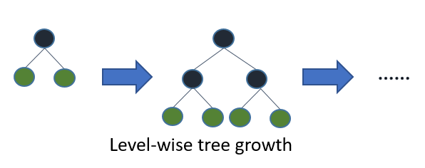
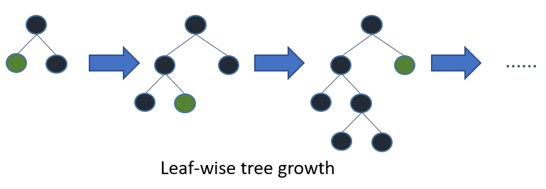

Features
========

This is a conceptual overview of how LightGBM works\ `[1] <#references>`__. We assume familiarity with decision tree boosting algorithms to focus instead on aspects of LightGBM that may differ from other boosting packages. For detailed algorithms, please refer to the citations or source code.

Optimization in Speed and Memory Usage
--------------------------------------

Many boosting tools use pre-sort-based algorithms\ `[2, 3] <#references>`__ (e.g. default algorithm in xgboost) for decision tree learning. It is a simple solution, but not easy to optimize.

LightGBM uses histogram-based algorithms\ `[4, 5, 6] <#references>`__, which bucket continuous feature (attribute) values into discrete bins. This speeds up training and reduces memory usage. Advantages of histogram-based algorithms include the following:

-  **Reduced cost of calculating the gain for each split**

   -  Pre-sort-based algorithms have time complexity ``O(#data)``

   -  Computing the histogram has time complexity ``O(#data)``, but this involves only a fast sum-up operation. Once the histogram is constructed, a histogram-based algorithm has time complexity ``O(#bins)``, and ``#bins`` is far smaller than ``#data``.

-  **Use histogram subtraction for further speedup**

   -  To get one leaf's histograms in a binary tree, use the histogram subtraction of its parent and its neighbor

   -  So it needs to construct histograms for only one leaf (with smaller ``#data`` than its neighbor). It then can get histograms of its neighbor by histogram subtraction with small cost (``O(#bins)``)
   
-  **Reduce memory usage**

   -  Replaces continuous values with discrete bins. If ``#bins`` is small, can use small data type, e.g. uint8\_t, to store training data

   -  No need to store additional information for pre-sorting feature values

-  **Reduce communication cost for distributed learning**

Sparse Optimization
-------------------

-  Need only ``O(2 * #non_zero_data)`` to construct histogram for sparse features

Optimization in Accuracy
------------------------

Leaf-wise (Best-first) Tree Growth
~~~~~~~~~~~~~~~~~~~~~~~~~~~~~~~~~~

Most decision tree learning algorithms grow trees by level (depth)-wise, like the following image:

LightGBM grows trees leaf-wise (best-first)\ `[7] <#references>`__. It will choose the leaf with max delta loss to grow.
Holding ``#leaf`` fixed, leaf-wise algorithms tend to achieve lower loss than level-wise algorithms.

Leaf-wise may cause over-fitting when ``#data`` is small, so LightGBM includes the ``max_depth`` parameter to limit tree depth. However, trees still grow leaf-wise even when ``max_depth`` is specified.

de of the tree.

Optimal Split for Categorical Features
~~~~~~~~~~~~~~~~~~~~~~~~~~~~~~~~~~~~~~

It is common to represent categorical features with one-hot encoding, but this approach is suboptimal for tree learners. Particularly for high-cardinality categorical features, a tree built on one-hot features tends to be unbalanced and needs to grow very deep to achieve good accuracy.

Instead of one-hot encoding, the optimal solution is to split on a categorical feature by partitioning its categories into 2 subsets. If the feature has ``k`` categories, there are ``2^(k-1) - 1`` possible partitions.
But there is an efficient solution for regression trees\ `[8] <#references>`__. It needs about ``O(k * log(k))`` to find the optimal partition.

The basic idea is to sort the categories according to the training objective at each split.
More specifically, LightGBM sorts the histogram (for a categorical feature) according to its accumulated values (``sum_gradient / sum_hessian``) and then finds the best split on the sorted histogram.

Optimization in Network Communication
-------------------------------------

It only needs to use some collective communication algorithms, like "All reduce", "All gather" and "Reduce scatter", in distributed learning of LightGBM.
LightGBM implements state-of-art algorithms\ `[9] <#references>`__.
These collective communication algorithms can provide much better performance than point-to-point communication.

.. _Optimization in Parallel Learning:

Optimization in Distributed Learning
------------------------------------

LightGBM provides the following distributed learning algorithms.

Feature Parallel
~~~~~~~~~~~~~~~~

Traditional Algorithm
^^^^^^^^^^^^^^^^^^^^^

Feature parallel aims to parallelize the "Find Best Split" in the decision tree. The procedure of traditional feature parallel is:

1. Partition data vertically (different machines have different feature set).

2. Workers find local best split point {feature, threshold} on local feature set.

3. Communicate local best splits with each other and get the best one.

4. Worker with best split to perform split, then send the split result of data to other workers.

5. Other workers split data according to received data.

The shortcomings of traditional feature parallel:

-  Has computation overhead, since it cannot speed up "split", whose time complexity is ``O(#data)``.
   Thus, feature parallel cannot speed up well when ``#data`` is large.

-  Need communication of split result, which costs about ``O(#data / 8)`` (one bit for one data).

Feature Parallel in LightGBM
^^^^^^^^^^^^^^^^^^^^^^^^^^^^

Since feature parallel cannot speed up well when ``#data`` is large, we make a little change: instead of partitioning data vertically, every worker holds the full data.
Thus, LightGBM doesn't need to communicate for split result of data since every worker knows how to split data.
And ``#data`` won't be larger, so it is reasonable to hold the full data in every machine.

The procedure of feature parallel in LightGBM:

1. Workers find local best split point {feature, threshold} on local feature set.

2. Communicate local best splits with each other and get the best one.

3. Perform best split.

However, this feature parallel algorithm still suffers from computation overhead for "split" when ``#data`` is large.
So it will be better to use data parallel when ``#data`` is large.

Data Parallel
~~~~~~~~~~~~~

Traditional Algorithm
^^^^^^^^^^^^^^^^^^^^^

Data parallel aims to parallelize the whole decision learning. The procedure of data parallel is:

1. Partition data horizontally.

2. Workers use local data to construct local histograms.

3. Merge global histograms from all local histograms.

4. Find best split from merged global histograms, then perform splits.

The shortcomings of traditional data parallel:

-  High communication cost.
   If using point-to-point communication algorithm, communication cost for one machine is about ``O(#machine * #feature * #bin)``.
   If using collective communication algorithm (e.g. "All Reduce"), communication cost is about ``O(2 * #feature * #bin)`` (check cost of "All Reduce" in chapter 4.5 at `[9] <#references>`__).

Data Parallel in LightGBM
^^^^^^^^^^^^^^^^^^^^^^^^^

We reduce communication cost of data parallel in LightGBM:

1. Instead of "Merge global histograms from all local histograms", LightGBM uses "Reduce Scatter" to merge histograms of different (non-overlapping) features for different workers.
   Then workers find the local best split on local merged histograms and sync up the global best split.

2. As aforementioned, LightGBM uses histogram subtraction to speed up training.
   Based on this, we can communicate histograms only for one leaf, and get its neighbor's histograms by subtraction as well.

All things considered, data parallel in LightGBM has time complexity ``O(0.5 * #feature * #bin)``.

Voting Parallel
~~~~~~~~~~~~~~~

Voting parallel further reduces the communication cost in `Data Parallel <#data-parallel>`__ to constant cost.
It uses two-stage voting to reduce the communication cost of feature histograms\ `[10] <#references>`__.

GPU Support
-----------

Thanks `@huanzhang12 <https://github.com/huanzhang12>`__ for contributing this feature. Please read `[11] <#references>`__ to get more details.

- `GPU Installation <./Installation-Guide.rst#build-gpu-version>`__

- `GPU Tutorial <./GPU-Tutorial.rst>`__

Applications and Metrics
------------------------

LightGBM supports the following applications:

-  regression, the objective function is L2 loss

-  binary classification, the objective function is logloss

-  multi classification

-  cross-entropy, the objective function is logloss and supports training on non-binary labels

-  LambdaRank, the objective function is LambdaRank with NDCG

LightGBM supports the following metrics:

-  L1 loss

-  L2 loss

-  Log loss

-  Classification error rate

-  AUC

-  NDCG

-  MAP

-  Multi-class log loss

-  Multi-class error rate

-  AUC-mu ``(new in v3.0.0)``

-  Average precision ``(new in v3.1.0)``

-  Fair

-  Huber

-  Poisson

-  Quantile

-  MAPE

-  Kullback-Leibler

-  Gamma

-  Tweedie

For more details, please refer to `Parameters <./Parameters.rst#metric-parameters>`__.

Other Features
--------------

-  Limit ``max_depth`` of tree while grows tree leaf-wise

-  `DART <https://arxiv.org/abs/1505.01866>`__

-  L1/L2 regularization

-  Bagging

-  Column (feature) sub-sample

-  Continued train with input GBDT model

-  Continued train with the input score file

-  Weighted training

-  Validation metric output during training

-  Multiple validation data

-  Multiple metrics

-  Early stopping (both training and prediction)

-  Prediction for leaf index

For more details, please refer to `Parameters <./Parameters.rst>`__.

References
----------

[1] Guolin Ke, Qi Meng, Thomas Finley, Taifeng Wang, Wei Chen, Weidong Ma, Qiwei Ye, Tie-Yan Liu. "`LightGBM\: A Highly Efficient Gradient Boosting Decision Tree`_." Advances in Neural Information Processing Systems 30 (NIPS 2017), pp. 3149-3157.

[2] Mehta, Manish, Rakesh Agrawal, and Jorma Rissanen. "SLIQ: A fast scalable classifier for data mining." International Conference on Extending Database Technology. Springer Berlin Heidelberg, 1996.

[3] Shafer, John, Rakesh Agrawal, and Manish Mehta. "SPRINT: A scalable parallel classifier for data mining." Proc. 1996 Int. Conf. Very Large Data Bases. 1996.

[4] Ranka, Sanjay, and V. Singh. "CLOUDS: A decision tree classifier for large datasets." Proceedings of the 4th Knowledge Discovery and Data Mining Conference. 1998.

[5] Machado, F. P. "Communication and memory efficient parallel decision tree construction." (2003).

[6] Li, Ping, Qiang Wu, and Christopher J. Burges. "Mcrank: Learning to rank using multiple classification and gradient boosting." Advances in Neural Information Processing Systems 20 (NIPS 2007).

[7] Shi, Haijian. "Best-first decision tree learning." Diss. The University of Waikato, 2007.

[8] Walter D. Fisher. "`On Grouping for Maximum Homogeneity`_." Journal of the American Statistical Association. Vol. 53, No. 284 (Dec., 1958), pp. 789-798.

[9] Thakur, Rajeev, Rolf Rabenseifner, and William Gropp. "`Optimization of collective communication operations in MPICH`_." International Journal of High Performance Computing Applications 19.1 (2005), pp. 49-66.

[10] Qi Meng, Guolin Ke, Taifeng Wang, Wei Chen, Qiwei Ye, Zhi-Ming Ma, Tie-Yan Liu. "`A Communication-Efficient Parallel Algorithm for Decision Tree`_." Advances in Neural Information Processing Systems 29 (NIPS 2016), pp. 1279-1287.

[11] Huan Zhang, Si Si and Cho-Jui Hsieh. "`GPU Acceleration for Large-scale Tree Boosting`_." SysML Conference, 2018.

.. _LightGBM\: A Highly Efficient Gradient Boosting Decision Tree: https://papers.nips.cc/paper/6907-lightgbm-a-highly-efficient-gradient-boosting-decision-tree.pdf

.. _On Grouping for Maximum Homogeneity: https://www.tandfonline.com/doi/abs/10.1080/01621459.1958.10501479

.. _Optimization of collective communication operations in MPICH: https://www.mcs.anl.gov/~thakur/papers/ijhpca-coll.pdf

.. _A Communication-Efficient Parallel Algorithm for Decision Tree: http://papers.nips.cc/paper/6381-a-communication-efficient-parallel-algorithm-for-decision-tree

.. _GPU Acceleration for Large-scale Tree Boosting: https://arxiv.org/abs/1706.08359
