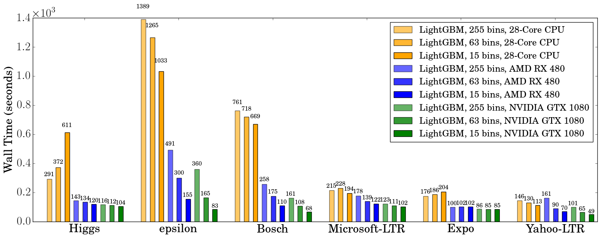

GPU Tuning Guide and Performance Comparison
===========================================

How It Works?
-------------

In LightGBM, the main computation cost during training is building the feature histograms. We use an efficient algorithm on GPU to accelerate this process.
The implementation is highly modular, and works for all learning tasks (classification, ranking, regression, etc). GPU acceleration also works in distributed learning settings.
GPU algorithm implementation is based on OpenCL and can work with a wide range of GPUs.

Supported Hardware
------------------

We target AMD Graphics Core Next (GCN) architecture and NVIDIA Maxwell and Pascal architectures.
Most AMD GPUs released after 2012 and NVIDIA GPUs released after 2014 should be supported. We have tested the GPU implementation on the following GPUs:

-  AMD RX 480 with AMDGPU-pro driver 16.60 on Ubuntu 16.10

-  AMD R9 280X (aka Radeon HD 7970) with fglrx driver 15.302.2301 on Ubuntu 16.10

-  NVIDIA GTX 1080 with driver 375.39 and CUDA 8.0 on Ubuntu 16.10

-  NVIDIA Titan X (Pascal) with driver 367.48 and CUDA 8.0 on Ubuntu 16.04

-  NVIDIA Tesla M40 with driver 375.39 and CUDA 7.5 on Ubuntu 16.04

Using the following hardware is discouraged:

-  NVIDIA Kepler (K80, K40, K20, most GeForce GTX 700 series GPUs) or earlier NVIDIA GPUs. They don't support hardware atomic operations in local memory space and thus histogram construction will be slow.

-  AMD VLIW4-based GPUs, including Radeon HD 6xxx series and earlier GPUs. These GPUs have been discontinued for years and are rarely seen nowadays.

How to Achieve Good Speedup on GPU
----------------------------------

#.  You want to run a few datasets that we have verified with good speedup (including Higgs, epsilon, Bosch, etc) to ensure your setup is correct.
    If you have multiple GPUs, make sure to set ``gpu_platform_id`` and ``gpu_device_id`` to use the desired GPU.
    Also make sure your system is idle (especially when using a shared computer) to get accuracy performance measurements.

#.  GPU works best on large scale and dense datasets. If dataset is too small, computing it on GPU is inefficient as the data transfer overhead can be significant.
    If you have categorical features, use the ``categorical_column`` option and input them into LightGBM directly; do not convert them into one-hot variables.

#.  To get good speedup with GPU, it is suggested to use a smaller number of bins.
    Setting ``max_bin=63`` is recommended, as it usually does not noticeably affect training accuracy on large datasets, but GPU training can be significantly faster than using the default bin size of 255.
    For some dataset, even using 15 bins is enough (``max_bin=15``); using 15 bins will maximize GPU performance. Make sure to check the run log and verify that the desired number of bins is used.

#.  Try to use single precision training (``gpu_use_dp=false``) when possible, because most GPUs (especially NVIDIA consumer GPUs) have poor double-precision performance.

Performance Comparison
----------------------

We evaluate the training performance of GPU acceleration on the following datasets:

+-----------+----------------+----------+------------+-----------+------------+
| Data      | Task           | Link     | #Examples  | #Features | Comments   |
+===========+================+==========+============+===========+============+
| Higgs     | Binary         | `link1`_ | 10,500,000 | 28        | use last   |
|           | classification |          |            |           | 500,000    |
|           |                |          |            |           | samples    |
|           |                |          |            |           | as test    |
|           |                |          |            |           | set        |
+-----------+----------------+----------+------------+-----------+------------+
| Epsilon   | Binary         | `link2`_ | 400,000    | 2,000     | use the    |
|           | classification |          |            |           | provided   |
|           |                |          |            |           | test set   |
+-----------+----------------+----------+------------+-----------+------------+
| Bosch     | Binary         | `link3`_ | 1,000,000  | 968       | use the    |
|           | classification |          |            |           | provided   |
|           |                |          |            |           | test set   |
+-----------+----------------+----------+------------+-----------+------------+
| Yahoo LTR | Learning to    | `link4`_ | 473,134    | 700       | set1.train |
|           | rank           |          |            |           | as train,  |
|           |                |          |            |           | set1.test  |
|           |                |          |            |           | as test    |
+-----------+----------------+----------+------------+-----------+------------+
| MS LTR    | Learning to    | `link5`_ | 2,270,296  | 137       | {S1,S2,S3} |
|           | rank           |          |            |           | as train   |
|           |                |          |            |           | set, {S5}  |
|           |                |          |            |           | as test    |
|           |                |          |            |           | set        |
+-----------+----------------+----------+------------+-----------+------------+
| Expo      | Binary         | `link6`_ | 11,000,000 | 700       | use last   |
|           | classification |          |            |           | 1,000,000  |
|           | (Categorical)  |          |            |           | as test    |
|           |                |          |            |           | set        |
+-----------+----------------+----------+------------+-----------+------------+

We used the following hardware to evaluate the performance of LightGBM GPU training.
Our CPU reference is **a high-end dual socket Haswell-EP Xeon server with 28 cores**;
GPUs include a budget GPU (RX 480) and a mainstream (GTX 1080) GPU installed on the same server.
It is worth mentioning that **the GPUs used are not the best GPUs in the market**;
if you are using a better GPU (like AMD RX 580, NVIDIA GTX 1080 Ti, Titan X Pascal, Titan Xp, Tesla P100, etc), you are likely to get a better speedup.

+--------------------------------+----------------+------------------+---------------+
| Hardware                       | Peak FLOPS     | Peak Memory BW   | Cost (MSRP)   |
+================================+================+==================+===============+
| AMD Radeon RX 480              | 5,161 GFLOPS   | 256 GB/s         | $199          |
+--------------------------------+----------------+------------------+---------------+
| NVIDIA GTX 1080                | 8,228 GFLOPS   | 320 GB/s         | $499          |
+--------------------------------+----------------+------------------+---------------+
| 2x Xeon E5-2683v3 (28 cores)   | 1,792 GFLOPS   | 133 GB/s         | $3,692        |
+--------------------------------+----------------+------------------+---------------+

During benchmarking on CPU we used only 28 physical cores of the CPU, and did not use hyper-threading cores,
because we found that using too many threads actually makes performance worse.
The following shows the training configuration we used:

::

    max_bin = 63
    num_leaves = 255
    num_iterations = 500
    learning_rate = 0.1
    tree_learner = serial
    task = train
    is_training_metric = false
    min_data_in_leaf = 1
    min_sum_hessian_in_leaf = 100
    ndcg_eval_at = 1,3,5,10
    device = gpu
    gpu_platform_id = 0
    gpu_device_id = 0
    num_thread = 28

We use the configuration shown above, except for the Bosch dataset, we use a smaller ``learning_rate=0.015`` and set ``min_sum_hessian_in_leaf=5``.
For all GPU training we vary the max number of bins (255, 63 and 15).
The GPU implementation is from commit `0bb4a82`_ of LightGBM, when the GPU support was just merged in.

The following table lists the accuracy on test set that CPU and GPU learner can achieve after 500 iterations.
GPU with the same number of bins can achieve a similar level of accuracy as on the CPU, despite using single precision arithmetic.
For most datasets, using 63 bins is sufficient.

+---------------------------+----------------+---------------+---------------+----------------+---------------+---------------+
|                           | CPU 255 bins   | CPU 63 bins   | CPU 15 bins   | GPU 255 bins   | GPU 63 bins   | GPU 15 bins   |
+===========================+================+===============+===============+================+===============+===============+
| Higgs AUC                 | 0.845612       | 0.845239      | 0.841066      | 0.845612       | 0.845209      | 0.840748      |
+---------------------------+----------------+---------------+---------------+----------------+---------------+---------------+
| Epsilon AUC               | 0.950243       | 0.949952      | 0.948365      | 0.950057       | 0.949876      | 0.948365      |
+---------------------------+----------------+---------------+---------------+----------------+---------------+---------------+
| Yahoo-LTR NDCG\ :sub:`1`  | 0.730824       | 0.730165      | 0.729647      | 0.730936       | 0.732257      | 0.73114       |
+---------------------------+----------------+---------------+---------------+----------------+---------------+---------------+
| Yahoo-LTR NDCG\ :sub:`3`  | 0.738687       | 0.737243      | 0.736445      | 0.73698        | 0.739474      | 0.735868      |
+---------------------------+----------------+---------------+---------------+----------------+---------------+---------------+
| Yahoo-LTR NDCG\ :sub:`5`  | 0.756609       | 0.755729      | 0.754607      | 0.756206       | 0.757007      | 0.754203      |
+---------------------------+----------------+---------------+---------------+----------------+---------------+---------------+
| Yahoo-LTR NDCG\ :sub:`10` | 0.79655        | 0.795827      | 0.795273      | 0.795894       | 0.797302      | 0.795584      |
+---------------------------+----------------+---------------+---------------+----------------+---------------+---------------+
| Expo AUC                  | 0.776217       | 0.771566      | 0.743329      | 0.776285       | 0.77098       | 0.744078      |
+---------------------------+----------------+---------------+---------------+----------------+---------------+---------------+
| MS-LTR NDCG\ :sub:`1`     | 0.521265       | 0.521392      | 0.518653      | 0.521789       | 0.522163      | 0.516388      |
+---------------------------+----------------+---------------+---------------+----------------+---------------+---------------+
| MS-LTR NDCG\ :sub:`3`     | 0.503153       | 0.505753      | 0.501697      | 0.503886       | 0.504089      | 0.501691      |
+---------------------------+----------------+---------------+---------------+----------------+---------------+---------------+
| MS-LTR NDCG\ :sub:`5`     | 0.509236       | 0.510391      | 0.507193      | 0.509861       | 0.510095      | 0.50663       |
+---------------------------+----------------+---------------+---------------+----------------+---------------+---------------+
| MS-LTR NDCG\ :sub:`10`    | 0.527835       | 0.527304      | 0.524603      | 0.528009       | 0.527059      | 0.524722      |
+---------------------------+----------------+---------------+---------------+----------------+---------------+---------------+
| Bosch AUC                 | 0.718115       | 0.721791      | 0.716677      | 0.717184       | 0.724761      | 0.717005      |
+---------------------------+----------------+---------------+---------------+----------------+---------------+---------------+

We record the wall clock time after 500 iterations, as shown in the figure below:

When using a GPU, it is advisable to use a bin size of 63 rather than 255, because it can speed up training significantly without noticeably affecting accuracy.
On CPU, using a smaller bin size only marginally improves performance, sometimes even slows down training,
like in Higgs (we can reproduce the same slowdown on two different machines, with different GCC versions).
We found that GPU can achieve impressive acceleration on large and dense datasets like Higgs and Epsilon.
Even on smaller and sparse datasets, a *budget* GPU can still compete and be faster than a 28-core Haswell server.

Memory Usage
------------

The next table shows GPU memory usage reported by ``nvidia-smi`` during training with 63 bins.
We can see that even the largest dataset just uses about 1 GB of GPU memory,
indicating that our GPU implementation can scale to huge datasets over 10x larger than Bosch or Epsilon.
Also, we can observe that generally a larger dataset (using more GPU memory, like Epsilon or Bosch) has better speedup,
because the overhead of invoking GPU functions becomes significant when the dataset is small.

+-------------------------+---------+-----------+---------+----------+--------+-------------+
| Datasets                | Higgs   | Epsilon   | Bosch   | MS-LTR   | Expo   | Yahoo-LTR   |
+=========================+=========+===========+=========+==========+========+=============+
| GPU Memory Usage (MB)   | 611     | 901       | 1067    | 413      | 405    | 291         |
+-------------------------+---------+-----------+---------+----------+--------+-------------+

Further Reading
---------------

You can find more details about the GPU algorithm and benchmarks in the
following article:

Huan Zhang, Si Si and Cho-Jui Hsieh. `GPU Acceleration for Large-scale Tree Boosting`_. SysML Conference, 2018.

.. _link1: https://archive.ics.uci.edu/ml/datasets/HIGGS

.. _link2: http://www.csie.ntu.edu.tw/~cjlin/libsvmtools/datasets/binary.html

.. _link3: https://www.kaggle.com/c/bosch-production-line-performance/data

.. _link4: https://webscope.sandbox.yahoo.com/catalog.php?datatype=c

.. _link5: http://research.microsoft.com/en-us/projects/mslr/

.. _link6: http://stat-computing.org/dataexpo/2009/

.. _0bb4a82: https://github.com/microsoft/LightGBM/commit/0bb4a82

.. _GPU Acceleration for Large-scale Tree Boosting: https://arxiv.org/abs/1706.08359
