GPU Windows Compilation
=======================

This guide is for the MinGW build.

For the MSVC (Visual Studio) build with GPU, please refer to `Installation Guide <./Installation-Guide.rst#build-gpu-version>`__.
(We recommend you to use this since it is much easier).

Install LightGBM GPU version in Windows (CLI / R / Python), using MinGW/gcc
^^^^^^^^^^^^^^^^^^^^^^^^^^^^^^^^^^^^^^^^^^^^^^^^^^^^^^^^^^^^^^^^^^^^^^^^^^^

This is for a vanilla installation of Boost, including full compilation steps from source without precompiled libraries.

Installation steps (depends on what you are going to do):

-  Install the appropriate OpenCL SDK

-  Install MinGW

-  Install Boost

-  Install Git

-  Install CMake

-  Create LightGBM binaries

-  Debugging LightGBM in CLI (if GPU is crashing or any other crash reason)

If you wish to use another compiler like Visual Studio C++ compiler, you need to adapt the steps to your needs.

For this compilation tutorial, we are using AMD SDK for our OpenCL steps.
However, you are free to use any OpenCL SDK you want, you just need to adjust the PATH correctly.

You will also need administrator rights. This will not work without them.

At the end, you can restore your original PATH.

--------------

Modifying PATH (for newbies)
----------------------------

To modify PATH, just follow the pictures after going to the ``Control Panel``:

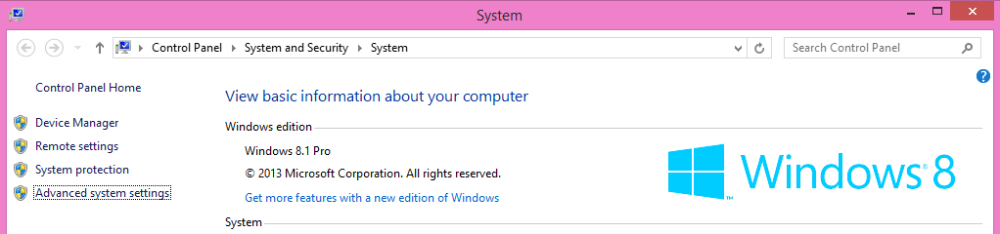

Then, go to ``Advanced`` > ``Environment Variables...``:

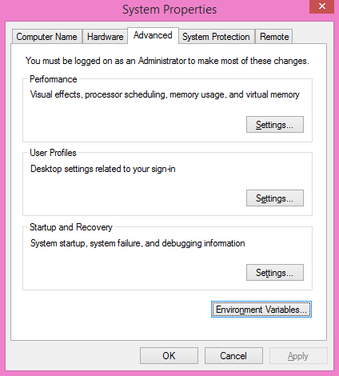

Under ``System variables``, the variable ``Path``:

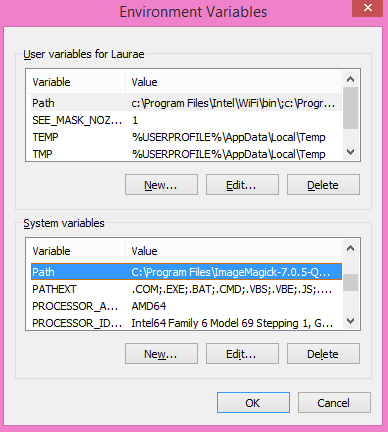

--------------

Antivirus Performance Impact
~~~~~~~~~~~~~~~~~~~~~~~~~~~~

Does not apply to you if you do not use a third-party antivirus nor the default preinstalled antivirus on Windows.

**Windows Defender or any other antivirus will have a significant impact on the speed you will be able to perform the steps.**
It is recommended to **turn them off temporarily** until you finished with building and setting up everything, then turn them back on, if you are using them.

--------------

OpenCL SDK Installation
-----------------------

Installing the appropriate OpenCL SDK requires you to download the correct vendor source SDK.
You need to know what you are going to use LightGBM!

-  For running on Intel, get `Intel SDK for OpenCL`_ (NOT RECOMMENDED).

-  For running on AMD, get `AMD APP SDK`_ (you may want to replace the ``OpenCL.dll`` from GPU driver package with the one from the SDK, if the one shipped with the driver lacks some functions).

-  For running on NVIDIA, get `CUDA Toolkit`_.

-  Or you can try to use `Khronos official OpenCL headers`_, the CMake module would automatically find the OpenCL library used in your system, though the result may be not portable.

Further reading and correspondence table (especially if you intend to use cross-platform devices,
like Intel CPU with AMD APP SDK): `GPU SDK Correspondence and Device Targeting Table <./GPU-Targets.rst>`__.

**Warning**: using Intel OpenCL is not recommended and may crash your machine due to being non compliant to OpenCL standards.
If your objective is to use LightGBM + OpenCL on CPU, please use AMD APP SDK instead (it can run also on Intel CPUs without any issues).

--------------

MinGW Correct Compiler Selection
--------------------------------

If you are expecting to use LightGBM without R, you need to install MinGW.
Installing MinGW is straightforward, download `this`_.

Make sure you are using the x86\_64 architecture, and do not modify anything else.
You may choose a version other than the most recent one if you need a previous MinGW version.

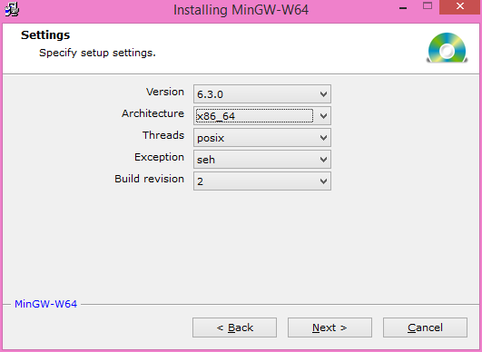

Then, add to your PATH the following (to adjust to your MinGW version):

::

    C:\Program Files\mingw-w64\x86_64-5.3.0-posix-seh-rt_v4-rev0\mingw64\bin

**Warning**: R users (even if you do not want LightGBM for R)

If you have RTools and MinGW installed, and wish to use LightGBM in R,
get rid of MinGW from PATH (to keep: ``c:\Rtools\bin;c:\Rtools\mingw_32\bin`` for 32-bit R installation,
``c:\Rtools\bin;c:\Rtools\mingw_64\bin`` for 64-bit R installation).

You can check which MinGW version you are using by running the following in a command prompt: ``gcc -v``:

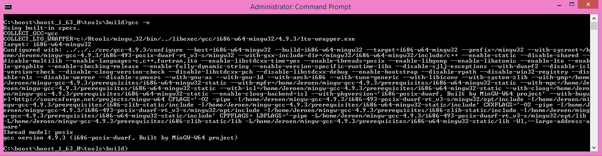

To check whether you need 32-bit or 64-bit MinGW for R, install LightGBM as usual and check for the following:

.. code:: r

    * installing *source* package 'lightgbm' ...
    ** libs
    c:/Rtools/mingw_64/bin/g++

If it says ``mingw_64`` then you need the 64-bit version (PATH with ``c:\Rtools\bin;c:\Rtools\mingw_64\bin``),
otherwise you need the 32-bit version (``c:\Rtools\bin;c:\Rtools\mingw_32\bin``), the latter being a very rare and untested case.

Quick installation of LightGBM can be done using:

.. code:: r

    devtools::install_github("Microsoft/LightGBM", subdir = "R-package")
    
--------------

Download the prebuilt Boost
---------------------------

Download  `Prebuilt Boost x86_64`_ or `Prebuilt Boost i686`_ and unpack them with `7zip`_, alternatively you can build Boost from source.

--------------

Boost Compilation
-----------------

Installing Boost requires to download Boost and to install it.
It takes about 10 minutes to several hours depending on your CPU speed and network speed.

We will assume an installation in ``C:\boost`` and a general installation (like in Unix variants: without versioning and without type tags).

There is one mandatory step to check the compiler:

-  **Warning**: if you want the R installation:
   If you have already MinGW in your PATH variable, get rid of it (you will link to the wrong compiler otherwise).

-  **Warning**: if you want the CLI installation:
   If you have already Rtools in your PATH variable, get rid of it (you will link to the wrong compiler otherwise).

-  R installation must have Rtools in PATH

-  CLI / Python installation must have MinGW (not Rtools) in PATH

In addition, assuming you are going to use ``C:\boost`` for the folder path,
you should add now already the following to PATH: ``C:\boost\boost-build\bin``, ``C:\boost\boost-build\include\boost``.
Adjust ``C:\boost`` if you install it elsewhere.

We can now start downloading and compiling the required Boost libraries:

-  Download `Boost`_ (for example, the filename for 1.63.0 version is ``boost_1_63_0.zip``)

-  Extract the archive to ``C:\boost``

-  Open a command prompt, and run

   .. code::

       cd C:\boost\boost_1_63_0\tools\build
       bootstrap.bat gcc
       b2 install --prefix="C:\boost\boost-build" toolset=gcc
       cd C:\boost\boost_1_63_0

To build the Boost libraries, you have two choices for command prompt:

-  If you have only one single core, you can use the default

   .. code::

       b2 install --build_dir="C:\boost\boost-build" --prefix="C:\boost\boost-build" toolset=gcc --with=filesystem,system threading=multi --layout=system release

-  If you want to do a multithreaded library building (faster), add ``-j N`` by replacing N by the number of cores/threads you have.
   For instance, for 2 cores, you would do

   .. code::

       b2 install --build_dir="C:\boost\boost-build" --prefix="C:\boost\boost-build" toolset=gcc --with=filesystem,system threading=multi --layout=system release -j 2

Ignore all the errors popping up, like Python, etc., they do not matter for us.

Your folder should look like this at the end (not fully detailed):

::

    - C
      |--- boost
      |------ boost_1_63_0
      |--------- some folders and files
      |------ boost-build
      |--------- bin
      |--------- include
      |------------ boost
      |--------- lib
      |--------- share

This is what you should (approximately) get at the end of Boost compilation:

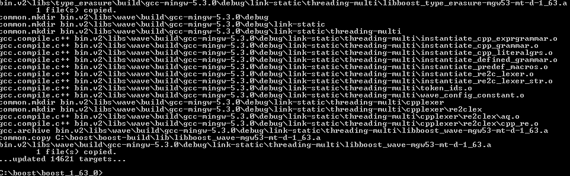

If you are getting an error:

-  Wipe your Boost directory

-  Close the command prompt

-  Make sure you added
   ``C:\boost\boost-build\bin``, ``C:\boost\boost-build\include\boost`` to
   your PATH (adjust accordingly if you use another folder)

-  Do the Boost compilation steps again (extract => command prompt => ``cd`` => ``bootstrap`` => ``b2`` => ``cd`` => ``b2``

--------------

Git Installation
----------------

Installing Git for Windows is straightforward, use the following `link`_.

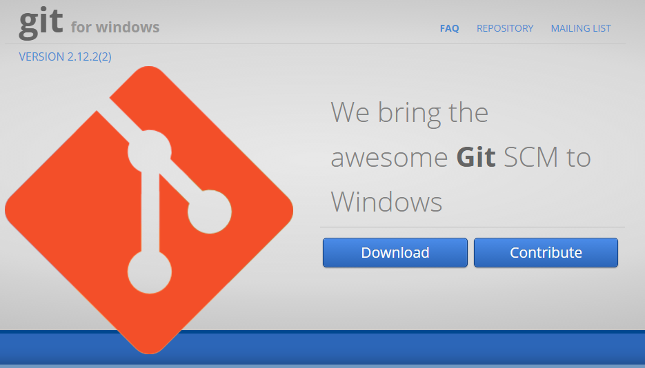

Now, we can fetch LightGBM repository for GitHub. Run Git Bash and the following command:

::

    cd C:/
    mkdir github_repos
    cd github_repos
    git clone --recursive https://github.com/microsoft/LightGBM

Your LightGBM repository copy should now be under ``C:\github_repos\LightGBM``.
You are free to use any folder you want, but you have to adapt.

Keep Git Bash open.

--------------

CMake Installation, Configuration, Generation
---------------------------------------------

**CLI / Python users only**

Installing CMake requires one download first and then a lot of configuration for LightGBM:

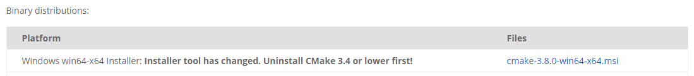

-  Download `CMake`_ (3.8 or higher)

-  Install CMake

-  Run cmake-gui

-  Select the folder where you put LightGBM for ``Where is the source code``,
   default using our steps would be ``C:/github_repos/LightGBM``

-  Copy the folder name, and add ``/build`` for "Where to build the binaries",
   default using our steps would be ``C:/github_repos/LightGBM/build``

-  Click ``Configure``

   .. image:: ./_static/images/screenshot-create-directory.png
      :align: center
      :target: ./_static/images/screenshot-create-directory.png

   .. image:: ./_static/images/screenshot-mingw-makefiles-to-use.png
      :align: center
      :target: ./_static/images/screenshot-mingw-makefiles-to-use.png

-  Lookup for ``USE_GPU`` and check the checkbox

   .. image:: ./_static/images/screenshot-use-gpu.png
      :align: center
      :target: ./_static/images/screenshot-use-gpu.png

-  Click ``Configure``

   You should get (approximately) the following after clicking Configure:

   .. image:: ./_static/images/screenshot-configured-lightgbm.png
      :align: center
      :target: ./_static/images/screenshot-configured-lightgbm.png

   ::

       Looking for CL_VERSION_2_0
       Looking for CL_VERSION_2_0 - found
       Found OpenCL: C:/Windows/System32/OpenCL.dll (found version "2.0") 
       OpenCL include directory:C:/Program Files (x86)/AMD APP SDK/3.0/include
       Boost version: 1.63.0
       Found the following Boost libraries:
         filesystem
         system
       Configuring done

-  Click ``Generate`` to get the following message:

   ::

       Generating done

This is straightforward, as CMake is providing a large help into locating the correct elements.

--------------

LightGBM Compilation (CLI: final step)
--------------------------------------

Installation in CLI
~~~~~~~~~~~~~~~~~~~

**CLI / Python users**

Creating LightGBM libraries is very simple as all the important and hard steps were done before.

You can do everything in the Git Bash console you left open:

-  If you closed Git Bash console previously, run this to get back to the build folder:

   ::

       cd C:/github_repos/LightGBM/build

-  If you did not close the Git Bash console previously, run this to get to the build folder:

   ::

       cd LightGBM/build

-  Setup MinGW as ``make`` using

   ::

       alias make='mingw32-make'

   otherwise, beware error and name clash!

-  In Git Bash, run ``make`` and see LightGBM being installing!

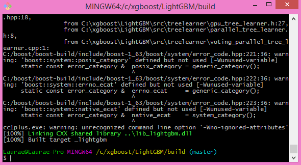

If everything was done correctly, you now compiled CLI LightGBM with GPU support!

Testing in CLI
~~~~~~~~~~~~~~

You can now test LightGBM directly in CLI in a **command prompt** (not Git Bash):

::

    cd C:/github_repos/LightGBM/examples/binary_classification
    "../../lightgbm.exe" config=train.conf data=binary.train valid=binary.test objective=binary device=gpu

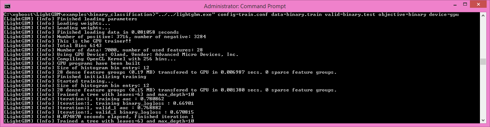

Congratulations for reaching this stage!

To learn how to target a correct CPU or GPU for training, please see: `GPU SDK Correspondence and Device Targeting Table <./GPU-Targets.rst>`__.

--------------

Debugging LightGBM Crashes in CLI
---------------------------------

Now that you compiled LightGBM, you try it... and you always see a segmentation fault or an undocumented crash with GPU support:

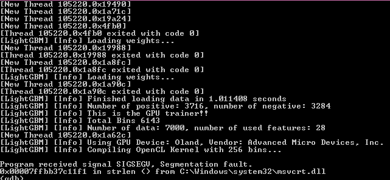

Please check if you are using the right device (``Using GPU device: ...``). You can find a list of your OpenCL devices using `GPUCapsViewer`_, and make sure you are using a discrete (AMD/NVIDIA) GPU if you have both integrated (Intel) and discrete GPUs installed. 
Also, try to set ``gpu_device_id = 0`` and ``gpu_platform_id = 0`` or ``gpu_device_id = -1`` and ``gpu_platform_id = -1`` to use the first platform and device or the default platform and device.
If it still does not work, then you should follow all the steps below.

You will have to redo the compilation steps for LightGBM to add debugging mode. This involves:

-  Deleting ``C:/github_repos/LightGBM/build`` folder

-  Deleting ``lightgbm.exe``, ``lib_lightgbm.dll``, and ``lib_lightgbm.dll.a`` files

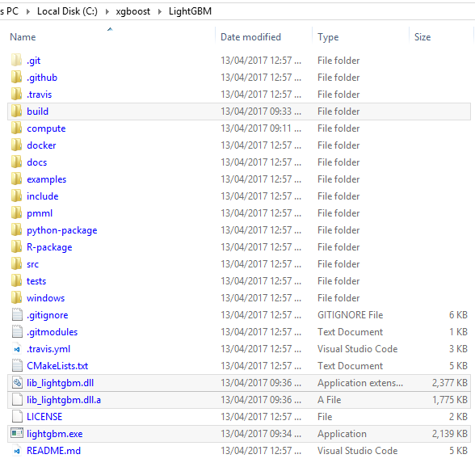

Once you removed the file, go into CMake, and follow the usual steps.
Before clicking "Generate", click on "Add Entry":

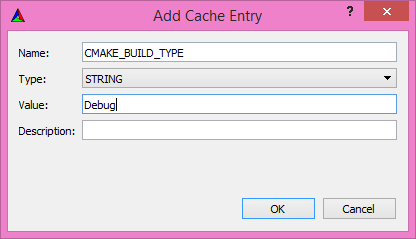

In addition, click on Configure and Generate:

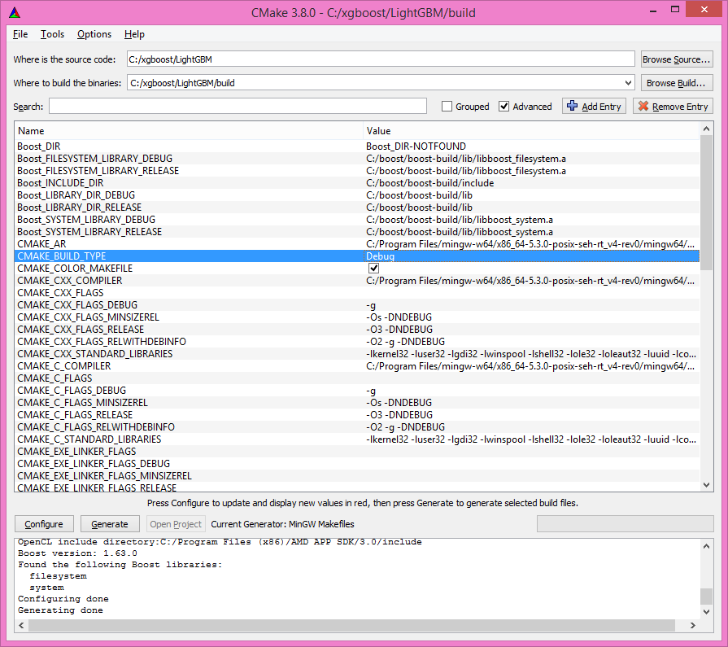

And then, follow the regular LightGBM CLI installation from there.

Once you have installed LightGBM CLI, assuming your LightGBM is in ``C:\github_repos\LightGBM``,
open a command prompt and run the following:

::

    gdb --args "../../lightgbm.exe" config=train.conf data=binary.train valid=binary.test objective=binary device=gpu

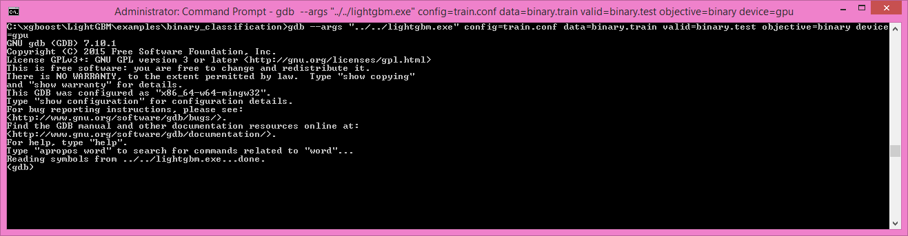

Type ``run`` and press the Enter key.

You will probably get something similar to this:

::

    [LightGBM] [Info] This is the GPU trainer!!
    [LightGBM] [Info] Total Bins 6143
    [LightGBM] [Info] Number of data: 7000, number of used features: 28
    [New Thread 105220.0x1a62c]
    [LightGBM] [Info] Using GPU Device: Oland, Vendor: Advanced Micro Devices, Inc.
    [LightGBM] [Info] Compiling OpenCL Kernel with 256 bins...

    Program received signal SIGSEGV, Segmentation fault.
    0x00007ffbb37c11f1 in strlen () from C:\Windows\system32\msvcrt.dll
    (gdb) 

There, write ``backtrace`` and press the Enter key as many times as gdb requests two choices:

::

    Program received signal SIGSEGV, Segmentation fault.
    0x00007ffbb37c11f1 in strlen () from C:\Windows\system32\msvcrt.dll
    (gdb) backtrace
    #0  0x00007ffbb37c11f1 in strlen () from C:\Windows\system32\msvcrt.dll
    #1  0x000000000048bbe5 in std::char_traits<char>::length (__s=0x0)
        at C:/PROGRA~1/MINGW-~1/X86_64~1.0-P/mingw64/x86_64-w64-mingw32/include/c++/bits/char_traits.h:267
    #2  std::operator+<char, std::char_traits<char>, std::allocator<char> > (__rhs="\\", __lhs=0x0)
        at C:/PROGRA~1/MINGW-~1/X86_64~1.0-P/mingw64/x86_64-w64-mingw32/include/c++/bits/basic_string.tcc:1157
    #3  boost::compute::detail::appdata_path[abi:cxx11]() () at C:/boost/boost-build/include/boost/compute/detail/path.hpp:38
    #4  0x000000000048eec3 in boost::compute::detail::program_binary_path (hash="d27987d5bd61e2d28cd32b8d7a7916126354dc81", create=create@entry=false)
        at C:/boost/boost-build/include/boost/compute/detail/path.hpp:46
    #5  0x00000000004913de in boost::compute::program::load_program_binary (hash="d27987d5bd61e2d28cd32b8d7a7916126354dc81", ctx=...)
        at C:/boost/boost-build/include/boost/compute/program.hpp:605
    #6  0x0000000000490ece in boost::compute::program::build_with_source (
        source="\n#ifndef _HISTOGRAM_256_KERNEL_\n#define _HISTOGRAM_256_KERNEL_\n\n#pragma OPENCL EXTENSION cl_khr_local_int32_base_atomics : enable\n#pragma OPENC
    L EXTENSION cl_khr_global_int32_base_atomics : enable\n\n//"..., context=...,
        options=" -D POWER_FEATURE_WORKGROUPS=5 -D USE_CONSTANT_BUF=0 -D USE_DP_FLOAT=0 -D CONST_HESSIAN=0 -cl-strict-aliasing -cl-mad-enable -cl-no-signed-zeros -c
    l-fast-relaxed-math") at C:/boost/boost-build/include/boost/compute/program.hpp:549
    #7  0x0000000000454339 in LightGBM::GPUTreeLearner::BuildGPUKernels () at C:\LightGBM\src\treelearner\gpu_tree_learner.cpp:583
    #8  0x00000000636044f2 in libgomp-1!GOMP_parallel () from C:\Program Files\mingw-w64\x86_64-5.3.0-posix-seh-rt_v4-rev0\mingw64\bin\libgomp-1.dll
    #9  0x0000000000455e7e in LightGBM::GPUTreeLearner::BuildGPUKernels (this=this@entry=0x3b9cac0)
        at C:\LightGBM\src\treelearner\gpu_tree_learner.cpp:569
    #10 0x0000000000457b49 in LightGBM::GPUTreeLearner::InitGPU (this=0x3b9cac0, platform_id=<optimized out>, device_id=<optimized out>)
        at C:\LightGBM\src\treelearner\gpu_tree_learner.cpp:720
    #11 0x0000000000410395 in LightGBM::GBDT::ResetTrainingData (this=0x1f26c90, config=<optimized out>, train_data=0x1f28180, objective_function=0x1f280e0,
        training_metrics=std::vector of length 2, capacity 2 = {...}) at C:\LightGBM\src\boosting\gbdt.cpp:98
    #12 0x0000000000402e93 in LightGBM::Application::InitTrain (this=this@entry=0x23f9d0) at C:\LightGBM\src\application\application.cpp:213
    ---Type <return> to continue, or q <return> to quit---
    #13 0x00000000004f0b55 in LightGBM::Application::Run (this=0x23f9d0) at C:/LightGBM/include/LightGBM/application.h:84
    #14 main (argc=6, argv=0x1f21e90) at C:\LightGBM\src\main.cpp:7

Right-click the command prompt, click "Mark", and select all the text from the first line (with the command prompt containing gdb) to the last line printed, containing all the log, such as:

::

    C:\LightGBM\examples\binary_classification>gdb --args "../../lightgbm.exe" config=train.conf data=binary.train valid=binary.test objective=binary device=gpu
    GNU gdb (GDB) 7.10.1
    Copyright (C) 2015 Free Software Foundation, Inc.
    License GPLv3+: GNU GPL version 3 or later <http://gnu.org/licenses/gpl.html>
    This is free software: you are free to change and redistribute it.
    There is NO WARRANTY, to the extent permitted by law.  Type "show copying"
    and "show warranty" for details.
    This GDB was configured as "x86_64-w64-mingw32".
    Type "show configuration" for configuration details.
    For bug reporting instructions, please see:
    <http://www.gnu.org/software/gdb/bugs/>.
    Find the GDB manual and other documentation resources online at:
    <http://www.gnu.org/software/gdb/documentation/>.
    For help, type "help".
    Type "apropos word" to search for commands related to "word"...
    Reading symbols from ../../lightgbm.exe...done.
    (gdb) run
    Starting program: C:\LightGBM\lightgbm.exe "config=train.conf" "data=binary.train" "valid=binary.test" "objective=binary" "device=gpu"
    [New Thread 105220.0x199b8]
    [New Thread 105220.0x783c]
    [Thread 105220.0x783c exited with code 0]
    [LightGBM] [Info] Finished loading parameters
    [New Thread 105220.0x19490]
    [New Thread 105220.0x1a71c]
    [New Thread 105220.0x19a24]
    [New Thread 105220.0x4fb0]
    [Thread 105220.0x4fb0 exited with code 0]
    [LightGBM] [Info] Loading weights...
    [New Thread 105220.0x19988]
    [Thread 105220.0x19988 exited with code 0]
    [New Thread 105220.0x1a8fc]
    [Thread 105220.0x1a8fc exited with code 0]
    [LightGBM] [Info] Loading weights...
    [New Thread 105220.0x1a90c]
    [Thread 105220.0x1a90c exited with code 0]
    [LightGBM] [Info] Finished loading data in 1.011408 seconds
    [LightGBM] [Info] Number of positive: 3716, number of negative: 3284
    [LightGBM] [Info] This is the GPU trainer!!
    [LightGBM] [Info] Total Bins 6143
    [LightGBM] [Info] Number of data: 7000, number of used features: 28
    [New Thread 105220.0x1a62c]
    [LightGBM] [Info] Using GPU Device: Oland, Vendor: Advanced Micro Devices, Inc.
    [LightGBM] [Info] Compiling OpenCL Kernel with 256 bins...
    
    Program received signal SIGSEGV, Segmentation fault.
    0x00007ffbb37c11f1 in strlen () from C:\Windows\system32\msvcrt.dll
    (gdb) backtrace
    #0  0x00007ffbb37c11f1 in strlen () from C:\Windows\system32\msvcrt.dll
    #1  0x000000000048bbe5 in std::char_traits<char>::length (__s=0x0)
        at C:/PROGRA~1/MINGW-~1/X86_64~1.0-P/mingw64/x86_64-w64-mingw32/include/c++/bits/char_traits.h:267
    #2  std::operator+<char, std::char_traits<char>, std::allocator<char> > (__rhs="\\", __lhs=0x0)
        at C:/PROGRA~1/MINGW-~1/X86_64~1.0-P/mingw64/x86_64-w64-mingw32/include/c++/bits/basic_string.tcc:1157
    #3  boost::compute::detail::appdata_path[abi:cxx11]() () at C:/boost/boost-build/include/boost/compute/detail/path.hpp:38
    #4  0x000000000048eec3 in boost::compute::detail::program_binary_path (hash="d27987d5bd61e2d28cd32b8d7a7916126354dc81", create=create@entry=false)
        at C:/boost/boost-build/include/boost/compute/detail/path.hpp:46
    #5  0x00000000004913de in boost::compute::program::load_program_binary (hash="d27987d5bd61e2d28cd32b8d7a7916126354dc81", ctx=...)
        at C:/boost/boost-build/include/boost/compute/program.hpp:605
    #6  0x0000000000490ece in boost::compute::program::build_with_source (
        source="\n#ifndef _HISTOGRAM_256_KERNEL_\n#define _HISTOGRAM_256_KERNEL_\n\n#pragma OPENCL EXTENSION cl_khr_local_int32_base_atomics : enable\n#pragma OPENCL EXTENSION cl_khr_global_int32_base_atomics : enable\n\n//"..., context=...,
        options=" -D POWER_FEATURE_WORKGROUPS=5 -D USE_CONSTANT_BUF=0 -D USE_DP_FLOAT=0 -D CONST_HESSIAN=0 -cl-strict-aliasing -cl-mad-enable -cl-no-signed-zeros -cl-fast-relaxed-math") at C:/boost/boost-build/include/boost/compute/program.hpp:549
    #7  0x0000000000454339 in LightGBM::GPUTreeLearner::BuildGPUKernels () at C:\LightGBM\src\treelearner\gpu_tree_learner.cpp:583
    #8  0x00000000636044f2 in libgomp-1!GOMP_parallel () from C:\Program Files\mingw-w64\x86_64-5.3.0-posix-seh-rt_v4-rev0\mingw64\bin\libgomp-1.dll
    #9  0x0000000000455e7e in LightGBM::GPUTreeLearner::BuildGPUKernels (this=this@entry=0x3b9cac0)
        at C:\LightGBM\src\treelearner\gpu_tree_learner.cpp:569
    #10 0x0000000000457b49 in LightGBM::GPUTreeLearner::InitGPU (this=0x3b9cac0, platform_id=<optimized out>, device_id=<optimized out>)
        at C:\LightGBM\src\treelearner\gpu_tree_learner.cpp:720
    #11 0x0000000000410395 in LightGBM::GBDT::ResetTrainingData (this=0x1f26c90, config=<optimized out>, train_data=0x1f28180, objective_function=0x1f280e0,
        training_metrics=std::vector of length 2, capacity 2 = {...}) at C:\LightGBM\src\boosting\gbdt.cpp:98
    #12 0x0000000000402e93 in LightGBM::Application::InitTrain (this=this@entry=0x23f9d0) at C:\LightGBM\src\application\application.cpp:213
    ---Type <return> to continue, or q <return> to quit---
    #13 0x00000000004f0b55 in LightGBM::Application::Run (this=0x23f9d0) at C:/LightGBM/include/LightGBM/application.h:84
    #14 main (argc=6, argv=0x1f21e90) at C:\LightGBM\src\main.cpp:7

And open an issue in GitHub `here`_ with that log.

.. _Intel SDK for OpenCL: https://software.intel.com/en-us/articles/opencl-drivers

.. _CUDA Toolkit: https://developer.nvidia.com/cuda-downloads

.. _AMD APP SDK: https://github.com/fireice-uk/xmr-stak/issues/1511

.. _Khronos official OpenCL headers: https://github.com/KhronosGroup/OpenCL-Headers

.. _this: http://iweb.dl.sourceforge.net/project/mingw-w64/Toolchains%20targetting%20Win32/Personal%20Builds/mingw-builds/installer/mingw-w64-install.exe

.. _Boost: https://www.boost.org/users/history/

.. _Prebuilt Boost x86_64: https://dl.fedoraproject.org/pub/fedora/linux/releases/29/Everything/x86_64/os/Packages/m/mingw64-boost-static-1.66.0-2.fc29.noarch.rpm

.. _Prebuilt Boost i686: https://dl.fedoraproject.org/pub/fedora/linux/releases/29/Everything/x86_64/os/Packages/m/mingw32-boost-static-1.66.0-2.fc29.noarch.rpm

.. _7zip: https://www.7-zip.org/download.html

.. _link: https://git-scm.com/download/win

.. _CMake: https://cmake.org/download/

.. _here: https://github.com/microsoft/LightGBM/issues

.. _GPUCapsViewer: http://www.ozone3d.net/gpu_caps_viewer/
