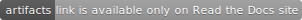

Installation Guide
==================

Here is the guide for the build of LightGBM CLI version.

All instructions below are aimed to compile 64-bit version of LightGBM.
It is worth to compile 32-bit version only in very rare special cases of environmental limitations.
32-bit version is slow and untested, so use it on your own risk and don't forget to adjust some commands in this guide.

For the build of Python-package and R-package, please refer to `Python-package`_ and `R-package`_ folders respectively.

Also you can download artifacts of the latest successful build in master branch: |download artifacts|.

.. contents:: **Contents**
    :depth: 1
    :local:
    :backlinks: none

Windows
~~~~~~~

On Windows LightGBM can be built using

- **Visual Studio**;

- **CMake** and **VS Build Tools**;

- **CMake** and **MinGW**.

Visual Studio (or VS Build Tools)
^^^^^^^^^^^^^^^^^^^^^^^^^^^^^^^^^

With GUI
********

1. Install `Visual Studio`_ (2015 or newer).

2. Download `zip archive`_ and unzip it.

3. Go to ``LightGBM-master/windows`` folder.

4. Open ``LightGBM.sln`` file with **Visual Studio**, choose ``Release`` configuration and click ``BUILD`` -> ``Build Solution (Ctrl+Shift+B)``.

   If you have errors about **Platform Toolset**, go to ``PROJECT`` -> ``Properties`` -> ``Configuration Properties`` -> ``General`` and select the toolset installed on your machine.

The ``.exe`` file will be in ``LightGBM-master/windows/x64/Release`` folder.

From Command Line
*****************

1. Install `Git for Windows`_, `CMake`_ (3.8 or higher) and `VS Build Tools`_ (**VS Build Tools** is not needed if **Visual Studio** (2015 or newer) is already installed).

2. Run the following commands:

   .. code::

     git clone --recursive https://github.com/microsoft/LightGBM
     cd LightGBM
     mkdir build
     cd build
     cmake -A x64 ..
     cmake --build . --target ALL_BUILD --config Release

The ``.exe`` and ``.dll`` files will be in ``LightGBM/Release`` folder.

MinGW-w64
^^^^^^^^^

1. Install `Git for Windows`_, `CMake`_ and `MinGW-w64`_.

2. Run the following commands:

   .. code::

     git clone --recursive https://github.com/microsoft/LightGBM
     cd LightGBM
     mkdir build
     cd build
     cmake -G "MinGW Makefiles" ..
     mingw32-make.exe -j4

The ``.exe`` and ``.dll`` files will be in ``LightGBM/`` folder.

**Note**: You may need to run the ``cmake -G "MinGW Makefiles" ..`` one more time if you encounter the ``sh.exe was found in your PATH`` error.

It is recommended to use **Visual Studio** for its better multithreading efficiency in **Windows** for many-core systems
(see `Question 4 <./FAQ.rst#i-am-using-windows-should-i-use-visual-studio-or-mingw-for-compiling-lightgbm>`__ and `Question 8 <./FAQ.rst#cpu-usage-is-low-like-10-in-windows-when-using-lightgbm-on-very-large-datasets-with-many-core-systems>`__).

Also, you may want to read `gcc Tips <./gcc-Tips.rst>`__.

Linux
~~~~~

On Linux LightGBM can be built using **CMake** and **gcc** or **Clang**.

1. Install `CMake`_.

2. Run the following commands:

   .. code::

     git clone --recursive https://github.com/microsoft/LightGBM ; cd LightGBM
     mkdir build ; cd build
     cmake ..
     make -j4

**Note**: glibc >= 2.14 is required.

Also, you may want to read `gcc Tips <./gcc-Tips.rst>`__.

macOS
~~~~~

On macOS LightGBM can be installed using **Homebrew**, or can be built using **CMake** and **Apple Clang** or **gcc**.

Apple Clang
^^^^^^^^^^^

Only **Apple Clang** version 8.1 or higher is supported.

Install Using ``Homebrew``
**************************

.. code::

  brew install lightgbm

Build from GitHub
*****************

1. Install `CMake`_ (3.12 or higher):

   .. code::

     brew install cmake

2. Install **OpenMP**:

   .. code::

     brew install libomp

3. Run the following commands:

   .. code::

     git clone --recursive https://github.com/microsoft/LightGBM ; cd LightGBM
     mkdir build ; cd build

     # For Mojave (10.14)
     cmake \
       -DOpenMP_C_FLAGS="-Xpreprocessor -fopenmp -I$(brew --prefix libomp)/include" \
       -DOpenMP_C_LIB_NAMES="omp" \
       -DOpenMP_CXX_FLAGS="-Xpreprocessor -fopenmp -I$(brew --prefix libomp)/include" \
       -DOpenMP_CXX_LIB_NAMES="omp" \
       -DOpenMP_omp_LIBRARY=$(brew --prefix libomp)/lib/libomp.dylib \
       ..

     # For High Sierra or earlier (<= 10.13)
     cmake ..

     make -j4

gcc
^^^

1. Install `CMake`_ (3.2 or higher):

   .. code::

     brew install cmake

2. Install **gcc**:

   .. code::

     brew install gcc

3. Run the following commands:

   .. code::

     git clone --recursive https://github.com/microsoft/LightGBM ; cd LightGBM
     export CXX=g++-7 CC=gcc-7  # replace "7" with version of gcc installed on your machine
     mkdir build ; cd build
     cmake ..
     make -j4

Also, you may want to read `gcc Tips <./gcc-Tips.rst>`__.

Docker
~~~~~~

Refer to `Docker folder <https://github.com/microsoft/LightGBM/tree/master/docker>`__.

Build Threadless Version (not Recommended)
~~~~~~~~~~~~~~~~~~~~~~~~~~~~~~~~~~~~~~~~~~

The default build version of LightGBM is based on OpenMP.
However, you can build the LightGBM without OpenMP support, but it is **strongly not recommended**.

Windows
^^^^^^^

On Windows version of LightGBM without OpenMP support can be built using

- **Visual Studio**;

- **CMake** and **VS Build Tools**;

- **CMake** and **MinGW**.

Visual Studio (or VS Build Tools)
*********************************

With GUI
--------

1. Install `Visual Studio`_ (2015 or newer).

2. Download `zip archive`_ and unzip it.

3. Go to ``LightGBM-master/windows`` folder.

4. Open ``LightGBM.sln`` file with **Visual Studio**.

5. Go to ``PROJECT`` -> ``Properties`` -> ``Configuration Properties`` -> ``C/C++`` -> ``Language`` and change the ``OpenMP Support`` property to ``No (/openmp-)``.

6. Get back to the project's main screen, then choose ``Release`` configuration and click ``BUILD`` -> ``Build Solution (Ctrl+Shift+B)``.

   If you have errors about **Platform Toolset**, go to ``PROJECT`` -> ``Properties`` -> ``Configuration Properties`` -> ``General`` and select the toolset installed on your machine.

The ``.exe`` file will be in ``LightGBM-master/windows/x64/Release`` folder.

From Command Line
-----------------

1. Install `Git for Windows`_, `CMake`_ (3.8 or higher) and `VS Build Tools`_ (**VS Build Tools** is not needed if **Visual Studio** (2015 or newer) is already installed).

2. Run the following commands:

   .. code::

     git clone --recursive https://github.com/microsoft/LightGBM
     cd LightGBM
     mkdir build
     cd build
     cmake -A x64 -DUSE_OPENMP=OFF ..
     cmake --build . --target ALL_BUILD --config Release

The ``.exe`` and ``.dll`` files will be in ``LightGBM/Release`` folder.

MinGW-w64
*********

1. Install `Git for Windows`_, `CMake`_ and `MinGW-w64`_.

2. Run the following commands:

   .. code::

     git clone --recursive https://github.com/microsoft/LightGBM
     cd LightGBM
     mkdir build
     cd build
     cmake -G "MinGW Makefiles" -DUSE_OPENMP=OFF ..
     mingw32-make.exe -j4

The ``.exe`` and ``.dll`` files will be in ``LightGBM/`` folder.

**Note**: You may need to run the ``cmake -G "MinGW Makefiles" -DUSE_OPENMP=OFF ..`` one more time if you encounter the ``sh.exe was found in your PATH`` error.

Linux
^^^^^

On Linux version of LightGBM without OpenMP support can be built using **CMake** and **gcc** or **Clang**.

1. Install `CMake`_.

2. Run the following commands:

   .. code::

     git clone --recursive https://github.com/microsoft/LightGBM ; cd LightGBM
     mkdir build ; cd build
     cmake -DUSE_OPENMP=OFF ..
     make -j4

**Note**: glibc >= 2.14 is required.

macOS
^^^^^

On macOS version of LightGBM without OpenMP support can be built using **CMake** and **Apple Clang** or **gcc**.

Apple Clang
***********

Only **Apple Clang** version 8.1 or higher is supported.

1. Install `CMake`_ (3.12 or higher):

   .. code::

     brew install cmake

2. Run the following commands:

   .. code::

     git clone --recursive https://github.com/microsoft/LightGBM ; cd LightGBM
     mkdir build ; cd build
     cmake -DUSE_OPENMP=OFF ..
     make -j4

gcc
***

1. Install `CMake`_ (3.2 or higher):

   .. code::

     brew install cmake

2. Install **gcc**:

   .. code::

     brew install gcc

3. Run the following commands:

   .. code::

     git clone --recursive https://github.com/microsoft/LightGBM ; cd LightGBM
     export CXX=g++-7 CC=gcc-7  # replace "7" with version of gcc installed on your machine
     mkdir build ; cd build
     cmake -DUSE_OPENMP=OFF ..
     make -j4

Build MPI Version
~~~~~~~~~~~~~~~~~

The default build version of LightGBM is based on socket. LightGBM also supports MPI.
`MPI`_ is a high performance communication approach with `RDMA`_ support.

If you need to run a parallel learning application with high performance communication, you can build the LightGBM with MPI support.

Windows
^^^^^^^

On Windows MPI version of LightGBM can be built using

- **MS MPI** and **Visual Studio**;

- **MS MPI**, **CMake** and **VS Build Tools**.

With GUI
********

1. You need to install `MS MPI`_ first. Both ``msmpisdk.msi`` and ``msmpisetup.exe`` are needed.

2. Install `Visual Studio`_ (2015 or newer).

3. Download `zip archive`_ and unzip it.

4. Go to ``LightGBM-master/windows`` folder.

5. Open ``LightGBM.sln`` file with **Visual Studio**, choose ``Release_mpi`` configuration and click ``BUILD`` -> ``Build Solution (Ctrl+Shift+B)``.

   If you have errors about **Platform Toolset**, go to ``PROJECT`` -> ``Properties`` -> ``Configuration Properties`` -> ``General`` and select the toolset installed on your machine.

The ``.exe`` file will be in ``LightGBM-master/windows/x64/Release_mpi`` folder.

From Command Line
*****************

1. You need to install `MS MPI`_ first. Both ``msmpisdk.msi`` and ``msmpisetup.exe`` are needed.

2. Install `Git for Windows`_, `CMake`_ (3.8 or higher) and `VS Build Tools`_ (**VS Build Tools** is not needed if **Visual Studio** (2015 or newer) is already installed).

3. Run the following commands:

   .. code::

     git clone --recursive https://github.com/microsoft/LightGBM
     cd LightGBM
     mkdir build
     cd build
     cmake -A x64 -DUSE_MPI=ON ..
     cmake --build . --target ALL_BUILD --config Release

The ``.exe`` and ``.dll`` files will be in ``LightGBM/Release`` folder.

**Note**: Building MPI version by **MinGW** is not supported due to the miss of MPI library in it.

Linux
^^^^^

On Linux MPI version of LightGBM can be built using **Open MPI**, **CMake** and **gcc** or **Clang**.

1. Install `Open MPI`_.

2. Install `CMake`_.

3. Run the following commands:

   .. code::

     git clone --recursive https://github.com/microsoft/LightGBM ; cd LightGBM
     mkdir build ; cd build
     cmake -DUSE_MPI=ON ..
     make -j4

**Note**: glibc >= 2.14 is required.

macOS
^^^^^

On macOS MPI version of LightGBM can be built using **Open MPI**, **CMake** and **Apple Clang** or **gcc**.

Apple Clang
***********

Only **Apple Clang** version 8.1 or higher is supported.

1. Install `CMake`_ (3.12 or higher):

   .. code::

     brew install cmake

2. Install **OpenMP**:

   .. code::

     brew install libomp

3. Install **Open MPI**:

   .. code::

     brew install open-mpi

4. Run the following commands:

   .. code::

     git clone --recursive https://github.com/microsoft/LightGBM ; cd LightGBM
     mkdir build ; cd build

     # For Mojave (10.14)
     cmake \
       -DUSE_MPI=ON \
       -DOpenMP_C_FLAGS="-Xpreprocessor -fopenmp -I$(brew --prefix libomp)/include" \
       -DOpenMP_C_LIB_NAMES="omp" \
       -DOpenMP_CXX_FLAGS="-Xpreprocessor -fopenmp -I$(brew --prefix libomp)/include" \
       -DOpenMP_CXX_LIB_NAMES="omp" \
       -DOpenMP_omp_LIBRARY=$(brew --prefix libomp)/lib/libomp.dylib \
       ..

     # For High Sierra or earlier (<= 10.13)
     cmake -DUSE_MPI=ON ..

     make -j4

gcc
***

1. Install `CMake`_ (3.2 or higher):

   .. code::

     brew install cmake

2. Install **gcc**:

   .. code::

     brew install gcc

3. Install **Open MPI**:

   .. code::

     brew install open-mpi

4. Run the following commands:

   .. code::

     git clone --recursive https://github.com/microsoft/LightGBM ; cd LightGBM
     export CXX=g++-7 CC=gcc-7  # replace "7" with version of gcc installed on your machine
     mkdir build ; cd build
     cmake -DUSE_MPI=ON ..
     make -j4

Build GPU Version
~~~~~~~~~~~~~~~~~

Linux
^^^^^

On Linux GPU version of LightGBM can be built using **OpenCL**, **Boost**, **CMake** and **gcc** or **Clang**.

The following dependencies should be installed before compilation:

-  **OpenCL** 1.2 headers and libraries, which is usually provided by GPU manufacture.

   The generic OpenCL ICD packages (for example, Debian package ``ocl-icd-libopencl1`` and ``ocl-icd-opencl-dev``) can also be used.

-  **libboost** 1.56 or later (1.61 or later is recommended).

   We use Boost.Compute as the interface to GPU, which is part of the Boost library since version 1.61. However, since we include the source code of Boost.Compute as a submodule, we only require the host has Boost 1.56 or later installed. We also use Boost.Align for memory allocation. Boost.Compute requires Boost.System and Boost.Filesystem to store offline kernel cache.

   The following Debian packages should provide necessary Boost libraries: ``libboost-dev``, ``libboost-system-dev``, ``libboost-filesystem-dev``.

-  **CMake** 3.2 or later.

To build LightGBM GPU version, run the following commands:

.. code::

  git clone --recursive https://github.com/microsoft/LightGBM ; cd LightGBM
  mkdir build ; cd build
  cmake -DUSE_GPU=1 ..
  # if you have installed NVIDIA CUDA to a customized location, you should specify paths to OpenCL headers and library like the following:
  # cmake -DUSE_GPU=1 -DOpenCL_LIBRARY=/usr/local/cuda/lib64/libOpenCL.so -DOpenCL_INCLUDE_DIR=/usr/local/cuda/include/ ..
  make -j4

Windows
^^^^^^^

On Windows GPU version of LightGBM can be built using **OpenCL**, **Boost**, **CMake** and **VS Build Tools** or **MinGW**.

If you use **MinGW**, the build procedure is similar to the build on Linux. Refer to `GPU Windows Compilation <./GPU-Windows.rst>`__ to get more details.

Following procedure is for the **MSVC** (Microsoft Visual C++) build.

1. Install `Git for Windows`_, `CMake`_ (3.8 or higher) and `VS Build Tools`_ (**VS Build Tools** is not needed if **Visual Studio** (2015 or newer) is installed).

2. Install **OpenCL** for Windows. The installation depends on the brand (NVIDIA, AMD, Intel) of your GPU card.

   - For running on Intel, get `Intel SDK for OpenCL`_.

   - For running on AMD, get AMD APP SDK.

   - For running on NVIDIA, get `CUDA Toolkit`_.

   Further reading and correspondence table: `GPU SDK Correspondence and Device Targeting Table <./GPU-Targets.rst>`__.

3. Install `Boost Binaries`_.

   **Note**: Match your Visual C++ version:
   
   Visual Studio 2015 -> ``msvc-14.0-64.exe``,

   Visual Studio 2017 -> ``msvc-14.1-64.exe``,

   Visual Studio 2019 -> ``msvc-14.2-64.exe``.

4. Run the following commands:

   .. code::

     git clone --recursive https://github.com/microsoft/LightGBM
     cd LightGBM
     mkdir build
     cd build
     cmake -A x64 -DUSE_GPU=1 -DBOOST_ROOT=C:/local/boost_1_63_0 -DBOOST_LIBRARYDIR=C:/local/boost_1_63_0/lib64-msvc-14.0 ..
     # if you have installed NVIDIA CUDA to a customized location, you should specify paths to OpenCL headers and library like the following:
     # cmake -A x64 -DUSE_GPU=1 -DBOOST_ROOT=C:/local/boost_1_63_0 -DBOOST_LIBRARYDIR=C:/local/boost_1_63_0/lib64-msvc-14.0 -DOpenCL_LIBRARY="C:/Program Files/NVIDIA GPU Computing Toolkit/CUDA/v10.0/lib/x64/OpenCL.lib" -DOpenCL_INCLUDE_DIR="C:/Program Files/NVIDIA GPU Computing Toolkit/CUDA/v10.0/include" ..
     cmake --build . --target ALL_BUILD --config Release

   **Note**: ``C:/local/boost_1_63_0`` and ``C:/local/boost_1_63_0/lib64-msvc-14.0`` are locations of your **Boost** binaries (assuming you've downloaded 1.63.0 version for Visual Studio 2015).

Docker
^^^^^^

Refer to `GPU Docker folder <https://github.com/microsoft/LightGBM/tree/master/docker/gpu>`__.

Build HDFS Version
~~~~~~~~~~~~~~~~~~

HDFS version of LightGBM was tested on CDH-5.14.4 cluster.

Linux
^^^^^

On Linux HDFS version of LightGBM can be built using **CMake** and **gcc**.

1. Install `CMake`_.

2. Run the following commands:

   .. code::

     git clone --recursive https://github.com/microsoft/LightGBM ; cd LightGBM
     mkdir build ; cd build
     cmake -DUSE_HDFS=ON ..
     # if you have installed HDFS to a customized location, you should specify paths to HDFS headers (hdfs.h) and library (libhdfs.so) like the following:
     # cmake \
     #   -DUSE_HDFS=ON \
     #   -DHDFS_LIB="/opt/cloudera/parcels/CDH-5.14.4-1.cdh5.14.4.p0.3/lib64/libhdfs.so" \
     #   -DHDFS_INCLUDE_DIR="/opt/cloudera/parcels/CDH-5.14.4-1.cdh5.14.4.p0.3/include/" \
     #   ..
     make -j4

Build Java Wrapper
~~~~~~~~~~~~~~~~~~

By the following instructions you can generate a JAR file containing the LightGBM `C API <./Development-Guide.rst#c-api>`__ wrapped by **SWIG**.

Windows
^^^^^^^

On Windows Java wrapper of LightGBM can be built using **Java**, **SWIG**, **CMake** and **VS Build Tools** or **MinGW**.

VS Build Tools
**************

1. Install `Git for Windows`_, `CMake`_ (3.8 or higher) and `VS Build Tools`_ (**VS Build Tools** is not needed if **Visual Studio** (2015 or newer) is already installed).

2. Install `SWIG`_ and **Java** (also make sure that ``JAVA_HOME`` is set properly).

3. Run the following commands:

   .. code::

     git clone --recursive https://github.com/microsoft/LightGBM
     cd LightGBM
     mkdir build
     cd build
     cmake -A x64 -DUSE_SWIG=ON ..
     cmake --build . --target ALL_BUILD --config Release

The ``.jar`` file will be in ``LightGBM/build`` folder and the ``.dll`` files will be in ``LightGBM/Release`` folder.

MinGW-w64
*********

1. Install `Git for Windows`_, `CMake`_ and `MinGW-w64`_.

2. Install `SWIG`_ and **Java** (also make sure that ``JAVA_HOME`` is set properly).

3. Run the following commands:

   .. code::

     git clone --recursive https://github.com/microsoft/LightGBM
     cd LightGBM
     mkdir build
     cd build
     cmake -G "MinGW Makefiles" -DUSE_SWIG=ON ..
     mingw32-make.exe -j4

The ``.jar`` file will be in ``LightGBM/build`` folder and the ``.dll`` files will be in ``LightGBM/`` folder.

**Note**: You may need to run the ``cmake -G "MinGW Makefiles" -DUSE_SWIG=ON ..`` one more time if you encounter the ``sh.exe was found in your PATH`` error.

It is recommended to use **VS Build Tools (Visual Studio)** for its better multithreading efficiency in **Windows** for many-core systems
(see `Question 4 <./FAQ.rst#i-am-using-windows-should-i-use-visual-studio-or-mingw-for-compiling-lightgbm>`__ and `Question 8 <./FAQ.rst#cpu-usage-is-low-like-10-in-windows-when-using-lightgbm-on-very-large-datasets-with-many-core-systems>`__).

Also, you may want to read `gcc Tips <./gcc-Tips.rst>`__.

Linux
^^^^^

On Linux Java wrapper of LightGBM can be built using **Java**, **SWIG**, **CMake** and **gcc** or **Clang**.

1. Install `CMake`_, `SWIG`_ and **Java** (also make sure that ``JAVA_HOME`` is set properly).

2. Run the following commands:

   .. code::

     git clone --recursive https://github.com/microsoft/LightGBM ; cd LightGBM
     mkdir build ; cd build
     cmake -DUSE_SWIG=ON ..
     make -j4

macOS
^^^^^

On macOS Java wrapper of LightGBM can be built using **Java**, **SWIG**, **CMake** and **Apple Clang** or **gcc**.

First, install `SWIG`_ and **Java** (also make sure that ``JAVA_HOME`` is set properly).
Then, either follow the **Apple Clang** or **gcc** installation instructions below.

Apple Clang
***********

Only **Apple Clang** version 8.1 or higher is supported.

1. Install `CMake`_ (3.12 or higher):

   .. code::

     brew install cmake

2. Install **OpenMP**:

   .. code::

     brew install libomp

3. Run the following commands:

   .. code::

     git clone --recursive https://github.com/microsoft/LightGBM ; cd LightGBM
     mkdir build ; cd build

     # For Mojave (10.14)
     cmake \
       -DUSE_SWIG=ON \
       -DAPPLE_OUTPUT_DYLIB=ON \
       -DOpenMP_C_FLAGS="-Xpreprocessor -fopenmp -I$(brew --prefix libomp)/include" \
       -DOpenMP_C_LIB_NAMES="omp" \
       -DOpenMP_CXX_FLAGS="-Xpreprocessor -fopenmp -I$(brew --prefix libomp)/include" \
       -DOpenMP_CXX_LIB_NAMES="omp" \
       -DOpenMP_omp_LIBRARY=$(brew --prefix libomp)/lib/libomp.dylib \
       ..

     # For High Sierra or earlier (<= 10.13)
     cmake -DUSE_SWIG=ON -DAPPLE_OUTPUT_DYLIB=ON ..

     make -j4

gcc
***

1. Install `CMake`_ (3.2 or higher):

   .. code::

     brew install cmake

2. Install **gcc**:

   .. code::

     brew install gcc

3. Run the following commands:

   .. code::

     git clone --recursive https://github.com/microsoft/LightGBM ; cd LightGBM
     export CXX=g++-7 CC=gcc-7  # replace "7" with version of gcc installed on your machine
     mkdir build ; cd build
     cmake -DUSE_SWIG=ON -DAPPLE_OUTPUT_DYLIB=ON ..
     make -j4

Also, you may want to read `gcc Tips <./gcc-Tips.rst>`__.

.. _Python-package: https://github.com/microsoft/LightGBM/tree/master/python-package

.. _R-package: https://github.com/microsoft/LightGBM/tree/master/R-package

.. _zip archive: https://github.com/microsoft/LightGBM/archive/master.zip

.. _Visual Studio: https://visualstudio.microsoft.com/downloads/

.. _Git for Windows: https://git-scm.com/download/win

.. _CMake: https://cmake.org/

.. _VS Build Tools: https://visualstudio.microsoft.com/downloads/

.. _MinGW-w64: https://mingw-w64.org/doku.php/download

.. _MPI: https://en.wikipedia.org/wiki/Message_Passing_Interface

.. _RDMA: https://en.wikipedia.org/wiki/Remote_direct_memory_access

.. _MS MPI: https://www.microsoft.com/en-us/download/details.aspx?id=57467

.. _Open MPI: https://www.open-mpi.org/

.. _Intel SDK for OpenCL: https://software.intel.com/en-us/articles/opencl-drivers

.. _CUDA Toolkit: https://developer.nvidia.com/cuda-downloads

.. _Boost Binaries: https://bintray.com/boostorg/release/boost-binaries/_latestVersion#files

.. _SWIG: http://www.swig.org/download.html
