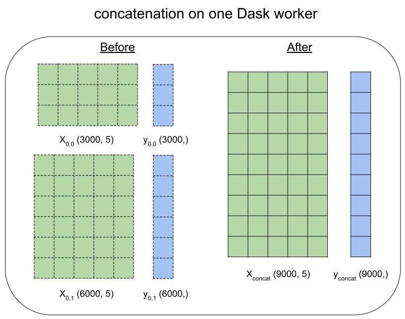

Distributed Learning Guide
==========================

.. _Parallel Learning Guide:

This guide describes distributed learning in LightGBM. Distributed learning allows the use of multiple machines to produce a single model.

Follow the `Quick Start <./Quick-Start.rst>`__ to know how to use LightGBM first.

How Distributed LightGBM Works
------------------------------

This section describes how distributed learning in LightGBM works. To learn how to do this in various programming languages and frameworks, please see `Integrations <#integrations>`__.

Choose Appropriate Parallel Algorithm
^^^^^^^^^^^^^^^^^^^^^^^^^^^^^^^^^^^^^

LightGBM provides 3 distributed learning algorithms now.

+--------------------+---------------------------+
| Parallel Algorithm | How to Use                |
+====================+===========================+
| Data parallel      | ``tree_learner=data``     |
+--------------------+---------------------------+
| Feature parallel   | ``tree_learner=feature``  |
+--------------------+---------------------------+
| Voting parallel    | ``tree_learner=voting``   |
+--------------------+---------------------------+

These algorithms are suited for different scenarios, which is listed in the following table:

+-------------------------+-------------------+-----------------+
|                         | #data is small    | #data is large  |
+=========================+===================+=================+
| **#feature is small**   | Feature Parallel  | Data Parallel   |
+-------------------------+-------------------+-----------------+
| **#feature is large**   | Feature Parallel  | Voting Parallel |
+-------------------------+-------------------+-----------------+

More details about these parallel algorithms can be found in `optimization in distributed learning <./Features.rst#optimization-in-distributed-learning>`__.

Integrations
------------

This section describes how to run distributed LightGBM training in various programming languages and frameworks. To learn how distributed learning in LightGBM works generally, please see `How Distributed LightGBM Works <#how-distributed-lightgbm-works>`__.

Apache Spark
^^^^^^^^^^^^

Apache Spark users can use `MMLSpark`_ for machine learning workflows with LightGBM. This project is not maintained by LightGBM's maintainers.

See `this MMLSpark example`_ and `the MMLSpark documentation`_ for additional information on using LightGBM on Spark.

.. note::

  ``MMLSpark`` is not maintained by LightGBM's maintainers. Bug reports or feature requests should be directed to https://github.com/Azure/mmlspark/issues.

Dask
^^^^

.. versionadded:: 3.2.0

LightGBM's Python package supports distributed learning via `Dask`_. This integration is maintained by LightGBM's maintainers.

.. warning::

    Dask integration is only tested on Linux.

Dask Examples
'''''''''''''

For sample code using ``lightgbm.dask``, see `these Dask examples`_.

Training with Dask
''''''''''''''''''

This section contains detailed information on performing LightGBM distributed training using Dask.

Configuring the Dask Cluster
****************************

**Allocating Threads**

When setting up a Dask cluster for training, give each Dask worker process at least two threads. If you do not do this, training might be substantially slower because communication work and training work will block each other.

If you do not have other significant processes competing with Dask for resources, just accept the default ``nthreads`` from your chosen ``dask.distributed`` cluster.

.. code:: python

  from distributed import Client, LocalCluster

  cluster = LocalCluster(n_workers=3)
  client = Client(cluster)

**Managing Memory**

Use the Dask diagnostic dashboard or your preferred monitoring tool to monitor Dask workers' memory consumption during training. As described in `the Dask worker documentation`_, Dask workers will automatically start spilling data to disk if memory consumption gets too high. This can substantially slow down computations, since disk I/O is usually much slower than reading the same data from memory.

  `At 60% of memory load, [Dask will] spill least recently used data to disk`

To reduce the risk of hitting memory limits, consider restarting each worker process before running any data loading or training code.

.. code:: python

  client.restart()

Setting Up Training Data
*************************

The estimators in ``lightgbm.dask`` expect that matrix-like or array-like data are provided in Dask DataFrame, Dask Array, or (in some cases) Dask Series format. See `the Dask DataFrame documentation`_ and `the Dask Array documentation`_ for more information on how to create such data structures.

.. image:: ./_static/images/dask-initial-setup.svg
  :align: center
  :width: 600px
  :alt: On the left, rectangles showing a 5 by 5 grid for a local dataset. On the right, two circles representing Dask workers, one with a 3 by 5 grid and one with a 2 by 5 grid.
  :target: ./_static/images/dask-initial-setup.svg

While setting up for training, ``lightgbm`` will concatenate all of the partitions on a worker into a single dataset. Distributed training then proceeds with one LightGBM worker process per Dask worker.

When setting up data partitioning for LightGBM training with Dask, try to follow these suggestions:

* ensure that each worker in the cluster has some of the training data
* try to give each worker roughly the same amount of data, especially if your dataset is small
* if you plan to train multiple models (for example, to tune hyperparameters) on the same data, use ``client.persist()`` before training to materialize the data one time

Using a Specific Dask Client
****************************

In most situations, you should not need to tell ``lightgbm.dask`` to use a specific Dask client. By default, the client returned by ``distributed.default_client()`` will be used.

However, you might want to explicitly control the Dask client used by LightGBM if you have multiple active clients in the same session. This is useful in more complex workflows like running multiple training jobs on different Dask clusters.

LightGBM's Dask estimators support setting an attribute ``client`` to control the client that is used.

.. code:: python

  import lightgbm as lgb
  from distributed import Client, LocalCluster

  cluster = LocalCluster()
  client = Client(cluster)

  # option 1: keyword argument in constructor
  dask_model = lgb.DaskLGBMClassifier(client=client)

  # option 2: set_params() after construction
  dask_model = lgb.DaskLGBMClassifier()
  dask_model.set_params(client=client)

Using Specific Ports
********************

At the beginning of training, ``lightgbm.dask`` sets up a LightGBM network where each Dask worker runs one long-running task that acts as a LightGBM worker. During training, LightGBM workers communicate with each other over TCP sockets. By default, random open ports are used when creating these sockets.

If the communication between Dask workers in the cluster used for training is restricted by firewall rules, you must tell LightGBM exactly what ports to use.

**Option 1: provide a specific list of addresses and ports**

LightGBM supports a parameter ``machines``, a comma-delimited string where each entry refers to one worker (host name or IP) and a port that that worker will accept connections on. If you provide this parameter to the estimators in ``lightgbm.dask``, LightGBM will not search randomly for ports.

For example, consider the case where you are running one Dask worker process on each of the following IP addresses:

::

  10.0.1.0
  10.0.2.0
  10.0.3.0

You could edit your firewall rules to allow traffic on one additional port on each of these hosts, then provide ``machines`` directly.

.. code:: python

  import lightgbm as lgb

  machines = "10.0.1.0:12401,10.0.2.0:12402,10.0.3.0:15000"
  dask_model = lgb.DaskLGBMRegressor(machines=machines)

If you are running multiple Dask worker processes on physical host in the cluster, be sure that there are multiple entries for that IP address, with different ports. For example, if you were running a cluster with ``nprocs=2`` (2 Dask worker processes per machine), you might open two additional ports on each of these hosts, then provide ``machines`` as follows.

.. code:: python

  import lightgbm as lgb

  machines = ",".join([
    "10.0.1.0:16000",
    "10.0.1.0:16001",
    "10.0.2.0:16000",
    "10.0.2.0:16001",
  ])
  dask_model = lgb.DaskLGBMRegressor(machines=machines)

.. warning::

  Providing ``machines`` gives you complete control over the networking details of training, but it also makes the training process fragile. Training will fail if you use ``machines`` and any of the following are true:

  * any of the ports mentioned in ``machines`` are not open when training begins
  * some partitions of the training data are held by machines that that are not present in ``machines``
  * some machines mentioned in ``machines`` do not hold any of the training data

**Option 2: specify one port to use on every worker**

If you are only running one Dask worker process on each host, and if you can reliably identify a port that is open on every host, using ``machines`` is unnecessarily complicated. If ``local_listen_port`` is given and ``machines`` is not, LightGBM will not search for ports randomly, but it will limit the list of addresses in the LightGBM network to those Dask workers that have a piece of the training data.

For example, consider the case where you are running one Dask worker process on each of the following IP addresses:

::

  10.0.1.0
  10.0.2.0
  10.0.3.0

You could edit your firewall rules to allow communication between any of the workers over one port, then provide that port via parameter ``local_listen_port``.

.. code:: python

  import lightgbm as lgb

  dask_model = lgb.DaskLGBMRegressor(local_listen_port=12400)

.. warning::

  Providing ``local_listen_port`` is slightly less fragile than ``machines`` because LightGBM will automatically figure out which workers have pieces of the training data. However, using this method, training can fail if any of the following are true:

  * the port ``local_listen_port`` is not open on any of the worker hosts
  * any machine has multiple Dask worker processes running on it

Prediction with Dask
''''''''''''''''''''

The estimators from ``lightgbm.dask`` can be used to create predictions based on data stored in Dask collections. In that interface, ``.predict()`` expects a Dask Array or Dask DataFrame, and returns a Dask Array of predictions.

See `the Dask prediction example`_ for some sample code that shows how to perform Dask-based prediction.

For model evaluation, consider using `the metrics functions from dask-ml`_. Those functions are intended to provide the same API as equivalent functions in ``sklearn.metrics``, but they use distributed computation powered by Dask to compute metrics without all of the input data ever needing to be on a single machine.

Saving Dask Models
''''''''''''''''''

After training with Dask, you have several options for saving a fitted model.

**Option 1: pickle the Dask estimator**

LightGBM's Dask estimators can be pickled directly with ``cloudpickle``, ``joblib``, or ``pickle``.

.. code:: python

  import dask.array as da
  import pickle
  import lightgbm as lgb
  from distributed import Client, LocalCluster

  cluster = LocalCluster(n_workers=2)
  client = Client(cluster)

  X = da.random.random((1000, 10), (500, 10))
  y = da.random.random((1000,), (500,))

  dask_model = lgb.DaskLGBMRegressor()
  dask_model.fit(X, y)

  with open("dask-model.pkl", "wb") as f:
      pickle.dump(dask_model, f)

A model saved this way can then later be loaded with whichever serialization library you used to save it.

.. code:: python

  import pickle
  with open("dask-model.pkl", "rb") as f:
      dask_model = pickle.load(f)

.. note::

  If you explicitly set a Dask client (see `Using a Specific Dask Client <#using-a-specific-dask-client>`__), it will not be saved when pickling the estimator. When loading a Dask estimator from disk, if you need to use a specific client you can add it after loading with ``dask_model.set_params(client=client)``.

**Option 2: pickle the sklearn estimator**

The estimators available from ``lightgbm.dask`` can be converted to an instance of the equivalent class from ``lightgbm.sklearn``. Choosing this option allows you to use Dask for training but avoid depending on any Dask libraries at scoring time.

.. code:: python

  import dask.array as da
  import joblib
  import lightgbm as lgb
  from distributed import Client, LocalCluster

  cluster = LocalCluster(n_workers=2)
  client = Client(cluster)

  X = da.random.random((1000, 10), (500, 10))
  y = da.random.random((1000,), (500,))

  dask_model = lgb.DaskLGBMRegressor()
  dask_model.fit(X, y)

  # convert to sklearn equivalent
  sklearn_model = dask_model.to_local()

  print(type(sklearn_model))
  #> lightgbm.sklearn.LGBMRegressor

  joblib.dump(sklearn_model, "sklearn-model.joblib")

A model saved this way can then later be loaded with whichever serialization library you used to save it.

.. code:: python

  import joblib

  sklearn_model = joblib.load("sklearn-model.joblib")

**Option 3: save the LightGBM Booster**

The lowest-level model object in LightGBM is the ``lightgbm.Booster``. After training, you can extract a Booster from the Dask estimator.

.. code:: python

  import dask.array as da
  import lightgbm as lgb
  from distributed import Client, LocalCluster

  cluster = LocalCluster(n_workers=2)
  client = Client(cluster)

  X = da.random.random((1000, 10), (500, 10))
  y = da.random.random((1000,), (500,))

  dask_model = lgb.DaskLGBMRegressor()
  dask_model.fit(X, y)

  # get underlying Booster object
  bst = dask_model.booster_

From the point forward, you can use any of the following methods to save the Booster:

* serialize with ``cloudpickle``, ``joblib``, or ``pickle``
* ``bst.dump_model()``: dump the model to a dictionary which could be written out as JSON
* ``bst.model_to_string()``: dump the model to a string in memory
* ``bst.save_model()``: write the output of ``bst.model_to_string()`` to a text file

Kubeflow
^^^^^^^^

`Kubeflow Fairing`_ supports LightGBM distributed training. `These examples`_ show how to get started with LightGBM and Kubeflow Fairing in a hybrid cloud environment.

Kubeflow users can also use the `Kubeflow XGBoost Operator`_ for machine learning workflows with LightGBM. You can see `this example`_ for more details.

Kubeflow integrations for LightGBM are not maintained by LightGBM's maintainers.

.. note::

  The Kubeflow integrations for LightGBM are not maintained by LightGBM's maintainers. Bug reports or feature requests should be directed to https://github.com/kubeflow/fairing/issues or https://github.com/kubeflow/xgboost-operator/issues.

LightGBM CLI
^^^^^^^^^^^^

.. _Build Parallel Version:

Preparation
'''''''''''

By default, distributed learning with LightGBM uses socket-based communication.

If you need to build distributed version with MPI support, please refer to `Installation Guide <./Installation-Guide.rst#build-mpi-version>`__.

Socket Version
**************

It needs to collect IP of all machines that want to run distributed learning in and allocate one TCP port (assume 12345 here) for all machines,
and change firewall rules to allow income of this port (12345). Then write these IP and ports in one file (assume ``mlist.txt``), like following:

.. code::

    machine1_ip 12345
    machine2_ip 12345

MPI Version
***********

It needs to collect IP (or hostname) of all machines that want to run distributed learning in.
Then write these IP in one file (assume ``mlist.txt``) like following:

.. code::

    machine1_ip
    machine2_ip

**Note**: For Windows users, need to start "smpd" to start MPI service. More details can be found `here`_.

Run Distributed Learning
''''''''''''''''''''''''

.. _Run Parallel Learning:

Socket Version
**************

1. Edit following parameters in config file:

   ``tree_learner=your_parallel_algorithm``, edit ``your_parallel_algorithm`` (e.g. feature/data) here.

   ``num_machines=your_num_machines``, edit ``your_num_machines`` (e.g. 4) here.

   ``machine_list_file=mlist.txt``, ``mlist.txt`` is created in `Preparation section <#preparation>`__.

   ``local_listen_port=12345``, ``12345`` is allocated in `Preparation section <#preparation>`__.

2. Copy data file, executable file, config file and ``mlist.txt`` to all machines.

3. Run following command on all machines, you need to change ``your_config_file`` to real config file.

   For Windows: ``lightgbm.exe config=your_config_file``

   For Linux: ``./lightgbm config=your_config_file``

MPI Version
***********

1. Edit following parameters in config file:

   ``tree_learner=your_parallel_algorithm``, edit ``your_parallel_algorithm`` (e.g. feature/data) here.

   ``num_machines=your_num_machines``, edit ``your_num_machines`` (e.g. 4) here.

2. Copy data file, executable file, config file and ``mlist.txt`` to all machines.

   **Note**: MPI needs to be run in the **same path on all machines**.

3. Run following command on one machine (not need to run on all machines), need to change ``your_config_file`` to real config file.

   For Windows:
   
   .. code::

       mpiexec.exe /machinefile mlist.txt lightgbm.exe config=your_config_file

   For Linux:

   .. code::

       mpiexec --machinefile mlist.txt ./lightgbm config=your_config_file

Example
'''''''

-  `A simple distributed learning example`_

.. _Dask: https://docs.dask.org/en/latest/

.. _MMLSpark: https://aka.ms/spark

.. _this MMLSpark example: https://github.com/Azure/mmlspark/blob/master/notebooks/samples/LightGBM%20-%20Overview.ipynb

.. _the Dask Array documentation: https://docs.dask.org/en/latest/array.html

.. _the Dask DataFrame documentation: https://docs.dask.org/en/latest/dataframe.html

.. _the Dask prediction example: https://github.com/microsoft/lightgbm/tree/master/examples/python-guide/dask/prediction.py

.. _the Dask worker documentation: https://distributed.dask.org/en/latest/worker.html#memory-management

.. _the metrics functions from dask-ml: https://ml.dask.org/modules/api.html#dask-ml-metrics-metrics

.. _the MMLSpark Documentation: https://github.com/Azure/mmlspark/blob/master/docs/lightgbm.md

.. _these Dask examples: https://github.com/microsoft/lightgbm/tree/master/examples/python-guide/dask

.. _Kubeflow Fairing: https://www.kubeflow.org/docs/components/fairing/fairing-overview

.. _These examples: https://github.com/kubeflow/fairing/tree/master/examples/lightgbm

.. _Kubeflow XGBoost Operator: https://github.com/kubeflow/xgboost-operator

.. _this example: https://github.com/kubeflow/xgboost-operator/tree/master/config/samples/lightgbm-dist

.. _here: https://www.youtube.com/watch?v=iqzXhp5TxUY

.. _A simple distributed learning example: https://github.com/microsoft/lightgbm/tree/master/examples/parallel_learning
