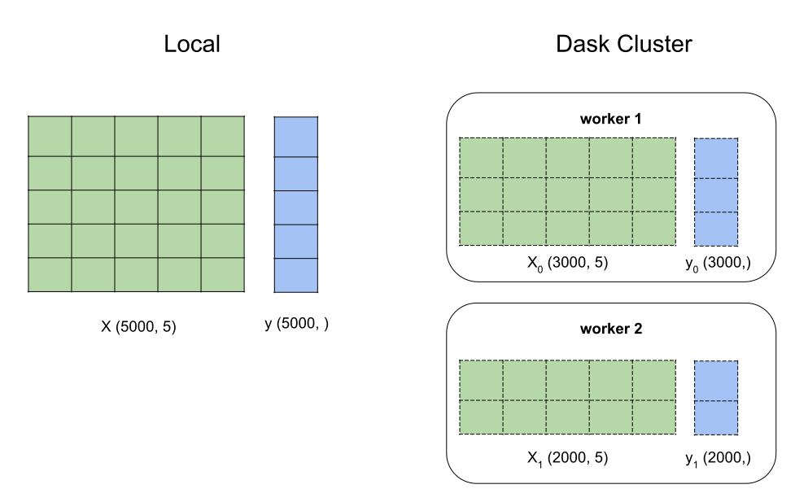

Distributed Learning Guide
==========================

.. _Parallel Learning Guide:

This guide describes distributed learning in LightGBM. Distributed learning allows the use of multiple machines to produce a single model.

Follow the `Quick Start <./Quick-Start.rst>`__ to know how to use LightGBM first.

How Distributed LightGBM Works
------------------------------

This section describes how distributed learning in LightGBM works. To learn how to do this in various programming languages and frameworks, please see `Integrations <#integrations>`__.

Choose Appropriate Parallel Algorithm
^^^^^^^^^^^^^^^^^^^^^^^^^^^^^^^^^^^^^

LightGBM provides 3 distributed learning algorithms now.

+--------------------+---------------------------+
| Parallel Algorithm | How to Use                |
+====================+===========================+
| Data parallel      | ``tree_learner=data``     |
+--------------------+---------------------------+
| Feature parallel   | ``tree_learner=feature``  |
+--------------------+---------------------------+
| Voting parallel    | ``tree_learner=voting``   |
+--------------------+---------------------------+

These algorithms are suited for different scenarios, which is listed in the following table:

+-------------------------+-------------------+-----------------+
|                         | #data is small    | #data is large  |
+=========================+===================+=================+
| **#feature is small**   | Feature Parallel  | Data Parallel   |
+-------------------------+-------------------+-----------------+
| **#feature is large**   | Feature Parallel  | Voting Parallel |
+-------------------------+-------------------+-----------------+

More details about these parallel algorithms can be found in `optimization in distributed learning <./Features.rst#optimization-in-distributed-learning>`__.

Integrations
------------

This section describes how to run distributed LightGBM training in various programming languages and frameworks. To learn how distributed learning in LightGBM works generally, please see `How Distributed LightGBM Works <#how-distributed-lightgbm-works>`__.

Apache Spark
^^^^^^^^^^^^

Apache Spark users can use `MMLSpark`_ for machine learning workflows with LightGBM. This project is not maintained by LightGBM's maintainers.

See `this MMLSpark example`_ and `the MMLSpark documentation`_ for additional information on using LightGBM on Spark.

.. note::

  ``MMLSpark`` is not maintained by LightGBM's maintainers. Bug reports or feature requests should be directed to https://github.com/Azure/mmlspark/issues.

Dask
^^^^

.. versionadded:: 3.2.0

LightGBM's Python package supports distributed learning via `Dask`_. This integration is maintained by LightGBM's maintainers.

Quick Dask Examples
'''''''''''''''''''

Dask-Based Training
'''''''''''''''''''

This section contains detailed information on performing LightGBM distributed training using Dask.

Configuring the Dask Cluster
****************************

**Allocating Threads**

When setting up a Dask cluster for training, give each Dask worker process at least two threads. If you do not do this, training might be substantially slower because communication work and training work will block each other.

If you do not have other significant processes competing with Dask for resources, just accept the default ``nthreads`` from your chosen ``dask.distributed`` cluster.

.. code:: python

  from distributed import Client, LocalCluster

  cluster = LocalCluster(n_workers=3)
  client = Client(cluster)

**Managing Memory**

Use the Dask diagnostic dashboard or your preferred monitoring tool to monitor Dask workers' memory consumption during training. As described in `the Dask worker documentation`_, Dask workers will automatically start spilling data to Disk if memory consumptio gets too high. This can substantially slow down computations, since disk I/O is usually much slower than reading the same data from memory.

  `At 60% of memory load, [Dask will] spill least recently used data to disk`

To reduce the risk of hitting memory limits, consider restarting each worker process before running any data loading or training code.

.. code:: python

  client.restart()

Setting Up Training Data
*************************

The estimators in ``lightgbm.dask`` expect that matrix-like or array-like data are provided in Dask DataFrame, Dask Array, or (in some cases) Dask Series format. See `the Dask DataFrame documentation`_ and `the Dask Array documentation`_ for more information on how to create such data structures.

While setting up for training, ``lightgbm`` will concatenate all of the partitions on a work into a single dataset. Distributed training then proceeds with one LightGBM worker process per Dask worker.

.. image:: ./_static/images/dask-concat.svg
  :align: center
  :width: 600px
  :alt: A section labeled "before" showing two grids and a section labeled "after" showing a single grid that looks like the two from "before" stacked one on top of the other.
  :target: ./_static/images/dask-concat.svg

When setting up data partitioning for LightGBM training with Dask, try to follow these suggestions:

* ensure that each worker in the cluster has a piece of the training data
* try to give each worker roughly the same amount of data, especially if your dataset is small
* if you plan to train multiple models (for example, to tune hyperparameters) on the same data use ``distributed.Client.persist()`` before training to materialize the data one time

Using a Specific Dask Client
****************************

In most situations, you should not need to tell ``lightgbm.dask`` to use a specific Dask client. By default, whenever you use code from that module LightGBM will call ``distributed.default_client()`` to find the most recent created client.

However, you might want to explicitly control the Dask client used by LightGBM if you have multiple active clients in the same session. This is useful in more complex workflows like running multiple training jobs on different Dask clusters.

LightGBM's Dask estimators support setting an attribute ``client`` to control the client that is used.

.. code:: python

  import lightgbm as lgb
  from distributed import LocalCluster, Client

  cluster = LocalCluster()
  client = Client(cluster)

  # option 1: keyword argumentt in constructor
  clf = lgb.DaskLGBMClassifier(client=client)

  # option 2: set_params() after construction
  clf = lgb.DaskLGBMClassifier()
  clf.set_params(client=client)

Note that the ``client`` for an estimator will not be stored if the model object is pickled. If you want to control the client used by a model object loaded from disk, use ``set_params()`` after loading. For more details on that, see `Saving Dask Models <#saving-dask-models>`__.

Using Specific Ports
********************

Saving Dask Models
''''''''''''''''''

Kubeflow
^^^^^^^^

`Kubeflow Fairing`_ supports LightGBM distributed training. `These examples`_ show how to get started with LightGBM and Kubeflow Fairing in a hybrid cloud environment.

Kubeflow users can also use the `Kubeflow XGBoost Operator`_ for machine learning workflows with LightGBM. You can see `this example`_ for more details.

Kubeflow integrations for LightGBM are not maintained by LightGBM's maintainers.

.. note::

  The Kubeflow integrations for LightGBM are not maintained by LightGBM's maintainers. Bug reports or feature requests should be directed to https://github.com/kubeflow/fairing/issues or https://github.com/kubeflow/xgboost-operator/issues.

LightGBM CLI
^^^^^^^^^^^^

.. _Build Parallel Version:

Preparation
'''''''''''

By default, distributed learning with LightGBM uses socket-based communication.

If you need to build distributed version with MPI support, please refer to `Installation Guide <./Installation-Guide.rst#build-mpi-version>`__.

Socket Version
**************

It needs to collect IP of all machines that want to run distributed learning in and allocate one TCP port (assume 12345 here) for all machines,
and change firewall rules to allow income of this port (12345). Then write these IP and ports in one file (assume ``mlist.txt``), like following:

.. code::

    machine1_ip 12345
    machine2_ip 12345

MPI Version
***********

It needs to collect IP (or hostname) of all machines that want to run distributed learning in.
Then write these IP in one file (assume ``mlist.txt``) like following:

.. code::

    machine1_ip
    machine2_ip

**Note**: For Windows users, need to start "smpd" to start MPI service. More details can be found `here`_.

Run Distributed Learning
''''''''''''''''''''''''

.. _Run Parallel Learning:

Socket Version
**************

1. Edit following parameters in config file:

   ``tree_learner=your_parallel_algorithm``, edit ``your_parallel_algorithm`` (e.g. feature/data) here.

   ``num_machines=your_num_machines``, edit ``your_num_machines`` (e.g. 4) here.

   ``machine_list_file=mlist.txt``, ``mlist.txt`` is created in `Preparation section <#preparation>`__.

   ``local_listen_port=12345``, ``12345`` is allocated in `Preparation section <#preparation>`__.

2. Copy data file, executable file, config file and ``mlist.txt`` to all machines.

3. Run following command on all machines, you need to change ``your_config_file`` to real config file.

   For Windows: ``lightgbm.exe config=your_config_file``

   For Linux: ``./lightgbm config=your_config_file``

MPI Version
***********

1. Edit following parameters in config file:

   ``tree_learner=your_parallel_algorithm``, edit ``your_parallel_algorithm`` (e.g. feature/data) here.

   ``num_machines=your_num_machines``, edit ``your_num_machines`` (e.g. 4) here.

2. Copy data file, executable file, config file and ``mlist.txt`` to all machines.

   **Note**: MPI needs to be run in the **same path on all machines**.

3. Run following command on one machine (not need to run on all machines), need to change ``your_config_file`` to real config file.

   For Windows:
   
   .. code::

       mpiexec.exe /machinefile mlist.txt lightgbm.exe config=your_config_file

   For Linux:

   .. code::

       mpiexec --machinefile mlist.txt ./lightgbm config=your_config_file

Example
'''''''

-  `A simple distributed learning example`_

.. _Dask: https://docs.dask.org/en/latest/

.. _MMLSpark: https://aka.ms/spark

.. _this MMLSpark example: https://github.com/Azure/mmlspark/blob/master/notebooks/samples/LightGBM%20-%20Quantile%20Regression%20for%20Drug%20Discovery.ipynb

.. _the Dask Array documentation: https://docs.dask.org/en/latest/array.html

.. _the Dask DataFrame documentation: https://docs.dask.org/en/latest/dataframe.html

.. _the Dask worker documentation: https://distributed.dask.org/en/latest/worker.html#memory-management

.. _the MMLSpark Documentation: https://github.com/Azure/mmlspark/blob/master/docs/lightgbm.md

.. _Kubeflow Fairing: https://www.kubeflow.org/docs/components/fairing/fairing-overview

.. _These examples: https://github.com/kubeflow/fairing/tree/master/examples/lightgbm

.. _Kubeflow XGBoost Operator: https://github.com/kubeflow/xgboost-operator

.. _this example: https://github.com/kubeflow/xgboost-operator/tree/master/config/samples/lightgbm-dist

.. _here: https://www.youtube.com/watch?v=iqzXhp5TxUY

.. _A simple distributed learning example: https://github.com/microsoft/lightgbm/tree/master/examples/parallel_learning
