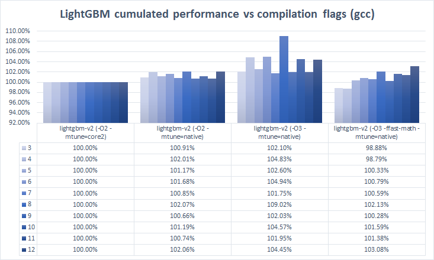

Recommendations When Using gcc
==============================

It is recommended to use ``-O3 -mtune=native`` to achieve maximum speed during LightGBM training.

Using Intel Ivy Bridge CPU on 1M x 1K Bosch dataset, the performance increases as follow:

+-------------------------------------+---------------------+
| Compilation Flag                    | Performance Index   |
+=====================================+=====================+
| ``-O2 -mtune=core2``                | 100.00%             |
+-------------------------------------+---------------------+
| ``-O2 -mtune=native``               | 100.90%             |
+-------------------------------------+---------------------+
| ``-O3 -mtune=native``               | 102.78%             |
+-------------------------------------+---------------------+
| ``-O3 -ffast-math -mtune=native``   | 100.64%             |
+-------------------------------------+---------------------+

You can find more details on the experimentation below:

-  `Laurae++/Benchmarks <https://sites.google.com/view/lauraepp/benchmarks/xgb-vs-lgb-feb-2017>`__

-  `Laurae2/gbt\_benchmarks <https://github.com/Laurae2/gbt_benchmarks>`__

-  `Laurae's Benchmark Master Data (Interactive) <https://public.tableau.com/views/gbt_benchmarks/Master-Data?:showVizHome=no>`__

-  `Kaggle Paris Meetup #12 Slides <https://drive.google.com/file/d/0B6qJBmoIxFe0ZHNCOXdoRWMxUm8/view>`__

The image below compares the runtime for training with different compiler options to a baseline using LightGBM compiled with ``-O2 --mtune=core2``. All three options are faster than that baseline. The best performance was achieved with ``-O3 --mtune=native``.

